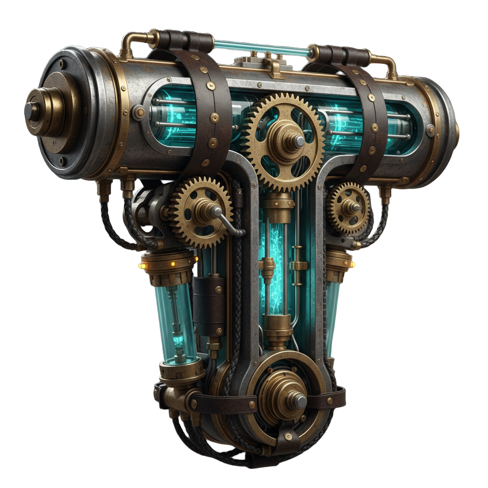
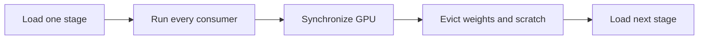

# KernelGoblin

> **Correct first. Fast second. Measured always.**

GPU ports are easy to announce and surprisingly hard to trust.

I kept running into the same problem: a useful model ships with a custom CUDA
kernel, someone rewrites something that looks similar, a tiny demo compiles,
and suddenly the whole model is described as "ported." What ran? On which GPU?
Did it match upstream? Was CPU fallback hiding in the graph? Nobody quite
knows.

KernelGoblin is our attempt to make that work less fuzzy. We pin the real
upstream source, preserve a reference, execute the physical backend, reconnect
the kernel to the model, and only then talk about speed.

The first journey is ambitious on purpose: run
[`microsoft/TRELLIS.2`](https://github.com/microsoft/TRELLIS.2), including its
full PBR mesh workflow, on Apple Silicon. The production Apple runtime is being
built in **Swift + Metal with no PyTorch dependency**. The working Torch/MPS
port stays around as a pinned conformance oracle while the native runtime earns
its way to parity.

That boundary is enforced, not ceremonial. `./kg validate` checks the declared
native source roots, rejects Python/Torch imports there, and keeps the Swift
package dependency-free. Torch can create immutable comparison fixtures under
`ports/trellis2/`; it is never part of native setup, testing, or inference.
KernelGoblin itself remains multi-backend so future CUDA-to-CUDA work still has
a home.

## So, What Did We Actually Run?

This input went through the pinned TRELLIS.2 graph on an Apple M3 Pro:

| Input image | Verified 1024-cascade output |
| :---: | :---: |
|  |  |

The output is a reloadable GLB with **6,717,817 vertices** and **13,774,312
faces**. The default 12-step run fit in **15.28 GB maximum RSS** on a 36 GB Mac
with CPU fallback disabled.

The good news: it works, the geometry is coherent, and the stage-wise memory
model fits comfortably.

The less exciting news: the reference MPS run took about **51 minutes**. This
is a correctness result, not a victory lap about speed. That slow but honest
baseline is exactly what the native Metal runtime is here to replace.

### Accomplished So Far

| Surface | Status | Strongest evidence |
| --- | --- | --- |
| O-Voxel Morton encode/decode | **Verified native Metal** | Bit-exact differential tests plus 65,536 randomized round trips |
| UV-space PBR raster | **Verified analytic Metal slice** | Physical Metal coverage, winding, degenerate, shared-edge, face-ID, and interpolation tests; CUDA nvdiffrast goldens remain |
| Swift safetensors runtime | **Verified native foundation** | Parsed the real 1.21 GB DINOv3 checkpoint and mapped it into one no-copy `MTLBuffer` |
| Real DINOv3 dense projection | **Verified native Metal slice** | `layer.0.attention.q_proj` from the pinned checkpoint, max absolute error `4.77e-7` against a CPU oracle |
| Complete DINOv3 512 conditioner | **Verified native Metal stage** | All 24 ViT-L/16 blocks run over the real 1,029-token layout; full-output max error `5.30e-5`, RMS `1.92e-6`, 75.9 MB peak arena use, and 2.23 s model time on Apple M3 Pro |
| Real TRELLIS shape-flow projection | **Verified native Metal slice** | Pinned 2.58 GB checkpoint, BF16 `[1536,32]` input layer, 17 rows, zero BF16 bit mismatches |
| TRELLIS timestep + shared adaLN | **Verified native Metal slice** | Real sinusoid, two-layer SiLU MLP, and 9,216-channel modulation; zero BF16 bit mismatches |
| TRELLIS cross-transformer block | **Verified native Metal slice** | Real block 0 normalization, 3D RoPE, two-token self-attention, cross-attention, 8,192-channel MLP, adaLN, and residuals match a pinned Torch BF16 fixture with `0.01747` RMS error |
| TRELLIS 30-block shape flow | **Verified native Metal stage** | Every production weight and block executes from the pinned 2.58 GB checkpoint; two-token final output matches the Torch oracle with `0.00615` RMS error |
| TRELLIS 30-block texture flow | **Verified native Metal stage** | The separate pinned 2.58 GB texture checkpoint executes all 30 blocks with the real 64-channel noise-plus-shape input; final RMS error is `0.00733` |
| Flow Euler + CFG orchestration | **Verified native Swift** | Exact 12-step schedule, interval CFG, rescaling, sequential positive/negative calls, shape and texture normalization, and real two-step checkpoint integrations |
| Bounded Metal allocation | **Verified native foundation** | Heap-backed arena rejects overflow, records cumulative-requested/current/peak bytes, releases dead buffers, and covers both sampler-to-flow integrations |
| Synchronized stage lifetime | **Verified native foundation** | DINO, sparse flow/decoder, shape, and texture sessions drain Metal, reach zero live arena bytes, destroy the arena, observe checkpoint `munmap`, and return standalone outputs |
| Sparse-structure transformer block | **Verified native Metal slice** | Real block 0 from the pinned 2.58 GB dense-flow checkpoint matches its authenticated Torch BF16 trace, including 128-wide SIMD-group attention and 3D RoPE |
| Sparse-structure 4,096-token flow | **Verified native production slice** | One complete sparse sampler step executes two CFG calls through all 30 blocks with the real 1,029-token context; model-call normalized RMS is at most `0.00923`, elapsed time is 92.5 s, and the bounded arena peaks at 525 MiB |
| Sparse-structure occupancy decoder | **Verified native Metal stage** | All 74 real tensors execute at the production `16 -> 64` spatial shape; exact occupancy matches the authenticated MPS oracle, normalized RMS is `0.000181`, and the bounded arena peaks at 224 MiB |
| Occupancy and coordinate extraction | **Verified native Swift** | Strict `> 0`, NaN/zero behavior, z-fast ordered coordinates, and exact 64-to-32 2x max pooling |
| CPU mesh to flexible dual grid | **Verified reference extension** | Pinned O-Voxel algorithm through LibTorch, AppleClang portability patch, tetrahedron fixtures; native Swift bridge remains |
| Sparse PBR sampling and glTF packing | **Verified reference component** | Bounded sampling, xatlas seams, RGBA and metallic-roughness packing, GLB reload; native assembly remains |
| TRELLIS.2 512 image-to-3D | **Verified Torch/MPS oracle** | Default 12 steps, reloadable 61 MB GLB |
| TRELLIS.2 1024 cascade | **Verified Torch/MPS oracle** | Default 12 steps, 15.28 GB maximum RSS, reloadable 272.8 MB GLB |
| Full PBR image-to-3D | **In progress** | Native UV and synthetic bake pass; full model artifact still needs final end-to-end proof |
| Existing-mesh texturing | **In progress** | CPU voxelizer, UV policy, staged reference CLI, and PBR baker exist; full native model path remains |
| Swift + Metal full model | **In progress** | Complete DINO, both SLat flows, one production sparse step, and the production sparse decoder pass; the 12-step sparse trajectory, image preprocessing, shape/texture decoding, mesh extraction, and PBR assembly remain |

That distinction matters. A kernel can be verified while a pipeline is still
unfinished. We do not promote the larger claim just because a nearby test is
green.

## How It Works

Every kernel follows the same path:


1. **Pin it.** Record the exact repository, revision, source paths, license,
   model checkpoint, and call site.
2. **Understand it.** Capture shapes, layouts, dtypes, edge behavior, overflow,
   errors, and synchronization boundaries before translating code.
3. **Port it.** Preserve the algorithm first. Clever changes can wait until we
   have something correct to compare against.
4. **Compare it.** Run deterministic references, randomized differential
   fixtures, invalid inputs, boundaries, and the real accelerator.
5. **Run it in the model.** A standalone kernel is not a model port. The real
   call site has to dispatch it and produce a valid artifact.
6. **Measure it.** Benchmarks disclose the device, workload, warmup,
   synchronization, transfers, allocations, and exactly what the timer covers.

## Fitting TRELLIS.2 Into Smaller Macs

TRELLIS.2 is called a 4B model, but that does not mean inference needs only the
bytes occupied by four billion weights. Image conditioning, multiple flow
models, shape and texture decoders, sparse topology, activations, allocator
state, mesh copies, UV charts, and a multi-million-texel bake all share the
same unified memory.

The current reference runtime already loads one component at a time:



The native runtime goes further. Each installed stage will be page-aligned,
hash-verified, mapped from disk, and wrapped with
`MTLBuffer(bytesNoCopy:)`. Fixed scratch buffers refuse oversized work instead
of quietly expanding. A `StageSession` owns the queue, arena, checkpoint, and
model graph; it cannot unmap weights until the queue drains and every arena
buffer is gone. Only a standalone semantic result crosses the boundary. The
important granularity is a **whole TRELLIS stage**, not one transformer layer
at a time.

This choice comes from investigating
[`drumih/turbo-fieldfare`](https://github.com/drumih/turbo-fieldfare/tree/1859181ae26eb39c9698437f806be62adc01367c),
an immaculate Swift/Metal runtime that runs a large mixture-of-experts model on
small Macs. Its bounded installer, mapped buffers, verified receipts, and
memory ledger fit our case beautifully. Its expert cache does not: TRELLIS is
dense and touches every layer during every denoising step, so streaming the
same stage from SSD twelve times would trade a memory problem for an I/O
problem.

The complete decision and package design live in
[`docs/NATIVE_TRELLIS2_ARCHITECTURE.md`](docs/NATIVE_TRELLIS2_ARCHITECTURE.md).

## Try The Native Work

You need Apple Silicon, Xcode with the Metal toolchain, Swift 6.2+, CMake 3.25+,
and Ninja.

```sh
./kg doctor
./kg list
./kg validate

# Native Swift + Metal checkpoint and model-layer tests
./kg model native-setup trellis2
./kg model native-audit trellis2
./kg model native-test trellis2

# Two independently buildable Metal kernels
./kg test trellis2/z_order
./kg test trellis2/uv_raster
./kg benchmark trellis2/uv_raster
```

`kg-trellis2` itself has no Python or Torch dependency. The lightweight `./kg`
developer wrapper uses the system Python standard library; commands in the
reference section below create a separate, ignored Torch environment.

The native CLI can inspect a real safetensors checkpoint without Torch:

```sh
swift run -c release kg-trellis2 \
  inspect-checkpoint /path/to/model.safetensors
```

It can also map the pinned DINOv3 checkpoint without a heap-sized weight copy
and dispatch a real attention projection on Metal:

```sh
swift run -c release kg-trellis2 \
  verify-dino-linear /path/to/dinov3/model.safetensors
```

And the first layer from the real 2.58 GB TRELLIS shape-flow checkpoint:

```sh
swift run -c release kg-trellis2 \
  verify-slat-input-layer /path/to/slat_flow_img2shape_dit_1_3B_512_bf16.safetensors

swift run -c release kg-trellis2 \
  verify-slat-conditioning /path/to/slat_flow_img2shape_dit_1_3B_512_bf16.safetensors

swift run -c release kg-trellis2 \
  verify-slat-self-attention /path/to/slat_flow_img2shape_dit_1_3B_512_bf16.safetensors

swift run -c release kg-trellis2 \
  verify-slat-cross-attention /path/to/slat_flow_img2shape_dit_1_3B_512_bf16.safetensors
```

Both verification commands authenticate the complete checkpoint SHA-256
before reporting a pinned-model result. The TRELLIS slice maps 2.584 GB,
copies zero weight bytes into a second heap allocation, and compares all
26,112 input-layer outputs with an independent CPU calculation before the
BF16 cast. The conditioning command continues through the real timestep MLP
and shared adaLN projection, producing 9,216 modulation channels with zero
post-cast BF16 bit mismatches. The attention commands execute the real block 0
weights through custom fused Metal attention without allocating a token by
token score matrix.

The strongest native block check uses a tiny committed fixture captured from
the pinned upstream Torch implementation. Torch is needed only to regenerate
that fixture, not to execute the Swift test:

```sh
KG_TRELLIS2_SHAPE_FLOW_CHECKPOINT=/path/to/slat_flow_img2shape_dit_1_3B_512_bf16.safetensors \
  swift test --filter realSLatBlockGolden
```

On the M3 Pro this runs one complete real block, including LayerNorm32, 3D RoPE,
self-attention, cross-attention, the 8,192-channel feed-forward network, adaLN,
and residuals. CPU Torch and Metal use different reduction trees, so the test
uses a BF16 differential bound rather than pretending bit identity is
meaningful across different reduction trees. The two-token fixture exercises
real Q/K scoring; every output is finite, maximum absolute error is `0.25`,
and aggregate RMS error is `0.01747` over 3,072 values.

The fused attention primitive now accepts validated signed-32-bit-compatible
segment offsets and proves that packed samples cannot cross-attend. The complete
SLat graph still enforces batch one because timestep modulation also needs a
per-token batch map before multi-sample execution would be correct.

The standard `./kg model native-test trellis2` command carries that block
through both complete 30-block SLat flows with their separate real production
checkpoints. It also drives each flow repeatedly through the native Euler
sampler and keeps temporary allocations inside a hard Metal heap budget. The
deliberately tiny two-token inputs keep this acceptance test quick while still
covering both full graphs. Shape-flow RMS error is `0.00615`; texture-flow RMS
error is `0.00733`. The two-step shape trajectory reports bounded numerical
drift separately because CFG feeds small cross-backend reduction differences
back into the next model call. These are graph and orchestration proofs, not
representative sparse-token memory or generation-speed claims.

On the development M3 Pro, the current UV raster benchmark reports:

```text
backend=Metal device="Apple M3 Pro"
workload=1024x1024 faces=2 warmup=3 iterations=20
timing=host allocation + upload + draw + synchronized readback
median_ms=6.810
```

This is an analytic two-triangle workload, not a full texture-bake timing.

## Run The Reference Model Today

Until the native graph reaches end-to-end parity, the pinned Torch/MPS runtime
remains available as a reference. It is isolated under `build/`; it does not
install packages globally.

TRELLIS.2's own weights are open. The upstream image pipeline separately uses
Meta's gated DINOv3 encoder, so you must accept its terms on Hugging Face and
authenticate once.

```sh
./kg model setup trellis2
./kg model test trellis2

./kg model run trellis2 \
  --input image.png \
  --output build/trellis2/output-512

./kg model run trellis2 \
  --pipeline-type 1024_cascade \
  --input image.png \
  --output build/trellis2/output-1024
```

Those commands preserve the proven vertex-color export. The portable PBR path
is deliberately explicit until its upstream mesh fixtures pass:

```sh
./kg model run trellis2 --experimental-pbr \
  --input image.png --output build/trellis2/output-pbr
```

The experimental flag runs real Metal rasterization and glTF material packing,
but it does not yet carry an upstream-parity or completed full-run claim. The
reference code itself is not the desired shipping architecture. Its job is to
provide real checkpoints, intermediate fixtures, end-to-end artifacts, and a
known behavior contract while we remove Torch from the production path.

## What “Verified” Means Here

Compiling is not execution. Execution is not conformance. Conformance for one
kernel is not full-model success.

A verified kernel includes:

- immutable upstream provenance and license;
- a CPU reference or independently captured golden fixture;
- representative, boundary, randomized, and invalid-input coverage;
- a test that dispatches the named physical backend;
- error checking and explicit synchronization; and
- a correctness-gated benchmark with honest timing boundaries.

A verified model run additionally records input and output hashes, exact
checkpoint revisions, steps, device and framework details, geometry and
material validation, elapsed time, memory evidence, and a reload of the final
artifact.

See [`docs/TRELLIS2_PORT.md`](docs/TRELLIS2_PORT.md) for the original reference
runs and [`kernels/trellis2/uv_raster/README.md`](kernels/trellis2/uv_raster/README.md)
for the newest native kernel boundary.

## Where We Are Going

### Now

- Finish the reusable Swift tensor runtime and page-aligned stage installer.
- Replace the correctness-first quadratic attention kernel with a tiled native
  implementation, then exercise both flows at captured production token counts
  under the new hard Metal arena budget.
- Complete the native DINOv3, TRELLIS flow, decoder, sampler, and PBR stages.

### Next

- Produce native 512 image-to-PBR-GLB and existing-mesh texturing artifacts.
- Compare native intermediates and rendered views with the pinned reference.
- Profile the complete pipeline, then fuse the actual bottlenecks instead of
  guessing which kernel looks interesting.

### Later

- Verify direct 1024 and 1536 independently.
- Add more real model kernels across Metal and CUDA without making every
  dependency mandatory.
- Grow a library of ports that upstream model projects can actually trust.

Now that we know the reference graph works, we can make it native and fast.

## Repository Map

| Path | Purpose |
| --- | --- |
| `Sources/KernelGoblinTrellis2/` | No-Torch Swift checkpoint, memory, and model runtime |
| `kernels/<model>/<operation>/` | Independently buildable CPU, Metal, or CUDA kernels |
| `ports/trellis2/` | Pinned Torch/MPS oracle, geometry reference, and parity fixtures |
| `kg`, `tools/kg.py` | Dependency-free selection, setup, test, benchmark, and model CLI |
| `.agents/skills/` | Reusable repository-local kernel-port workflow |
| `.codex/agents/` | Narrow read-only research and review specialists |
| `docs/` | Architecture, evidence, toolchain, and harness decisions |
| `build/`, `.build/` | Ignored native builds, weights, scratch, and generated evidence |

## Building With Agents, Without Outsourcing Trust

The agent harness helps us trace upstream code, split bounded research, and run
independent reviews. It is not the evidence.

Deterministic tests, physical backend dispatch, final artifact validation, and
reproducible manifests remain the evidence. Start with [`AGENTS.md`](AGENTS.md)
and the repository skill in
[`docs/AGENT_HARNESS.md`](docs/AGENT_HARNESS.md) if you are contributing a port.

## Upstream And License

- TRELLIS.2 source: [`microsoft/TRELLIS.2`](https://github.com/microsoft/TRELLIS.2)
- Pinned source revision: `75fbf0183001ed9876c8dbb35de6b68552ee08bd`
- TRELLIS.2-4B weights: `af44b45f2e35a493886929c6d786e563ec68364d`
- KernelGoblin license: [MIT](LICENSE)
- Third-party provenance: [THIRD_PARTY_NOTICES.md](THIRD_PARTY_NOTICES.md)

Bring a real kernel, its real call site, and the hardware you care about. The
goblin will take it from there.
