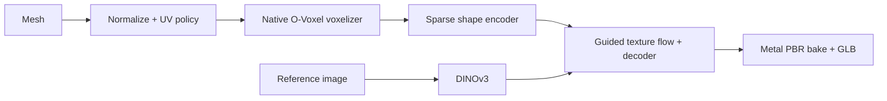
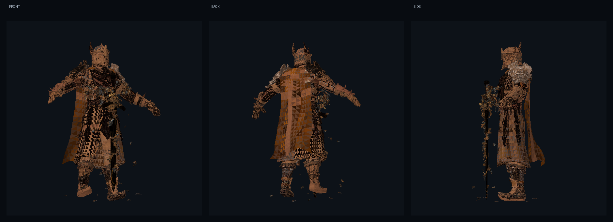
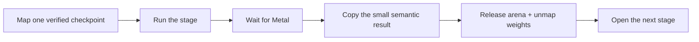
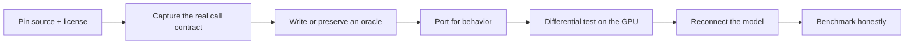

# KernelGoblin

> Correct first. Fast second. Measured always.

GPU ports are easy to announce and surprisingly hard to trust.

A kernel compiles. A tiny input runs. Maybe a fallback quietly did the real
work. Somewhere between those facts, the whole model gets called "ported."
KernelGoblin exists because we want a better answer than that.

This is a reusable home for custom model kernels and complete accelerator
ports: CUDA to Metal when we want a model to feel native on Apple Silicon,
CUDA to CUDA when the original kernel is correct but leaves performance on the
table, and CPU references wherever we need an honest baseline. Every port pins
its upstream source, carries a known-good oracle, executes the physical backend,
and reconnects to the real model before we make the larger claim.

Our first not-at-all-small experiment is
[`microsoft/TRELLIS.2`](https://github.com/microsoft/TRELLIS.2): image-to-3D,
existing-mesh texturing, UVs, six-channel PBR decoding, texture baking, and
reloadable GLB export on Apple Silicon.

## The Short Version

- The production Apple runtime is **Swift + Metal**. It does not import or link
  Python, PyTorch, MLX, or third-party Swift packages.
- Model stages are installed independently, hash-verified, memory-mapped, run,
  synchronized, and released before the next heavyweight stage is opened.
- Existing-mesh texturing has completed a real, default 12-step native run:
  223,711 source faces remained 223,711 output faces, two 2048 PBR textures
  reloaded from the GLB, maximum RSS was 3.04 GB, and the process recorded zero
  swaps.
- Native 512 image-to-PBR generation is implemented and its final default-step
  artifact gate is running. Until that artifact reloads, we keep the full native
  model status **in progress**.
- The optional Torch/MPS environment is an isolated oracle. Default install,
  test, generation, and texturing commands are native.

That last distinction is intentional. Implemented is not the same as verified,
and a verified component is not automatically a verified model.

## What We Have Made So Far

The earlier reference journey gave us a real target instead of a collection of
guesses:

| Input | Reloaded TRELLIS.2 reference output |
| :---: | :---: |
|  |  |

The right-hand preview is the pinned Torch/MPS **oracle**, not a disguised
native result. Its 1024-cascade GLB contains 6,717,817 vertices and 13,774,312
faces. A historical acceptance run observed 15.28 GB maximum RSS and roughly
51 minutes on a 36 GB M3 Pro. Treat that as prior reference evidence, not a
portable benchmark: the original run predates the stricter committed raw-run
record we now require. It was still useful - it proved the graph and open
TRELLIS weights work and gave us immutable outputs to port against.

The native runtime now covers the complete 512 graph:

```mermaid
flowchart LR
    I["Image"] --> V["Apple image prep"]
    V --> D["DINOv3 conditioner"]
    D --> S["Sparse structure flow"]
    S --> O["Occupancy decoder"]
    O --> F["Shape flow"]
    F --> T["Texture flow"]
    T --> G["Shape decoder + O-Voxel mesh"]
    G --> P["Guided six-channel PBR decoder"]
    P --> U["UV raster + bake"]
    U --> B["Reloadable GLB"]
```



Existing-mesh texturing enters through a second front door:



## Evidence, Without The Victory-Lap Version

We use four evidence tiers so a useful low-level result cannot quietly become a
full-model claim.

| Tier | What it means | TRELLIS.2 today |
| --- | --- | --- |
| End-to-end verified | Default settings, real checkpoints, physical backend, artifact reload | Native existing-mesh texturing; Torch/MPS 512 and 1024-cascade oracles |
| Production-stage verified | Complete real stage and checkpoint execute with authenticated comparisons | DINOv3, both 30-block flows, sparse structure flow/decoder, shape encoder |
| Analytic or tiny-fixture verified | Real backend and exact contract, deliberately small workload | Shape and guided texture decoders, Morton coding, UV raster, sparse attention, O-Voxel mesh extraction, PBR bake and GLB packing |
| Implemented, acceptance pending | Full call path exists but its final artifact gate is not complete | Native 512 image-to-PBR generation |

Some useful numbers from the physical M3 Pro verification:

- 93 real-checkpoint and component tests passed under Metal API validation.
- The full 12-step sparse-structure trajectory executed all 22 model calls;
  teacher-forced probes stayed below `0.01376` normalized RMS.
- Free-running BF16 feedback reached `0.7208` occupancy IoU with the captured
  oracle. We report that drift instead of calling it exact parity.
- The full shape encoder reaches `0.000700` normalized RMS. The authenticated
  mesh-to-O-Voxel-to-encoder handoff reaches `0.000555`, with exact sparse
  coordinates and all four subdivision guides.
- Shape and texture decoder PBR outputs reach `0.000628` and `0.001251`
  normalized RMS on their pinned fixtures.
- Every recorded heavyweight stage returns its bounded Metal arena to zero live
  bytes before its checkpoint mapping is closed.

The detailed ledger, exact hashes, timing boundaries, and semantic gaps live in
[`docs/TRELLIS2_PORT.md`](docs/TRELLIS2_PORT.md). The machine-readable source of
truth is [`ports/trellis2/model.toml`](ports/trellis2/model.toml).



The preview above is rendered from the accepted native GLB. Its exact command,
hardware/toolchain disclosure, raw stage ledger, process accounting, and hashes
are committed in
[`docs/evidence/trellis2-native-texturing-m3pro-2026-08-01.md`](docs/evidence/trellis2-native-texturing-m3pro-2026-08-01.md).

## Native Quick Start

You need an Apple Silicon Mac, Xcode with the Metal toolchain, Swift 6.2+,
CMake 3.25+, and Ninja.

```sh
./kg doctor
./kg list
./kg validate
```

TRELLIS.2's own model weights are open under MIT. Its image pipelines also use
Meta's separately gated DINOv3 encoder. Accept the DINOv3 terms on Hugging Face
once and provide a read token for installation:

```sh
export HF_TOKEN=hf_...

# Install all eight pinned components. Existing verified HF cache files are
# linked rather than downloaded again.
./kg model setup trellis2

# Or install only what one workflow needs.
./kg model setup trellis2 --feature generate
./kg model setup trellis2 --feature texture
```

Generate a PBR GLB from an image:

```sh
./kg model run trellis2 \
  --input image.png \
  --output build/trellis2/my-model.glb \
  --steps 12 \
  --texture-size 2048
```

Texture an existing mesh from a reference image:

```sh
./kg model texture trellis2 \
  --mesh model.ply \
  --input reference.png \
  --output build/trellis2/textured.glb \
  --uv-policy preserve-or-generate \
  --steps 12 \
  --texture-size 2048
```

Opaque inputs use Apple Vision foreground masking by default. Use
`--require-alpha` when an alpha matte is part of your input contract, or
`--accept-opaque` only when the background is already harmless.

Run the native verification ladder:

```sh
./kg model test trellis2
./kg model native-audit trellis2
./kg model native-benchmark trellis2
./kg model native-pbr-benchmark trellis2
```

`./kg model test` is intentionally substantial: it authenticates real
checkpoints and executes complete stages, including the production 12-step
sparse trajectory. Use focused `swift test --filter ...` commands while
developing one component.

## Why A 4B Model Needs More Than 8 GB

"4B" counts parameters in one headline model. It is not a memory budget.
TRELLIS.2 also needs DINO conditioning, multiple flow checkpoints, sparse
activations, decoder features, coordinate maps, mesh topology, UV seams, and
multi-million-texel PBR buffers. On a unified-memory Mac, the CPU and GPU share
the same pool too.

KernelGoblin avoids keeping the entire graph resident:



This is where the ideas from
[`drumih/turbo-fieldfare`](https://github.com/drumih/turbo-fieldfare/tree/1859181ae26eb39c9698437f806be62adc01367c)
fit beautifully: authenticated receipts, mapped buffers, explicit ownership,
and a memory ledger. We did **not** copy its expert cache. TRELLIS stages are
dense and touch every block on every denoising step; streaming those same
weights from SSD twelve times would replace a memory problem with an I/O
problem.

The full rationale is in
[`docs/NATIVE_TRELLIS2_ARCHITECTURE.md`](docs/NATIVE_TRELLIS2_ARCHITECTURE.md).

## The Optional Oracle

Python and Torch are kept on purpose, but only behind explicitly named oracle
commands in an ignored environment under `build/`:

```sh
./kg model oracle-setup trellis2
./kg model oracle-test trellis2

./kg model oracle-run trellis2 \
  --pipeline-type 1024_cascade \
  --input image.png \
  --output build/trellis2/oracle-output
```

The oracle generates fixtures and answers questions such as "what did pinned
upstream do at this exact boundary?" It is not installed by native setup and is
not loaded by native inference.

## Known Differences We Still Care About

This is a proper port, not a claim that Apple and CUDA take identical floating-
point paths.

- Native `--seed` uses documented SplitMix64 plus Box-Muller noise. It is
  deterministic across native runs, but the same number does not reproduce
  PyTorch's RNG stream.
- Apple Vision foreground masking is a portable native policy, not numerical
  parity with upstream RMBG.
- Supplied UVs can be preserved as a useful extension. Pinned upstream
  texturing regenerates its atlas through CuMesh.
- Model I/O unwrap is used only when it preserves all valid faces. A
  deterministic per-face atlas is the topology-safe native fallback; it is
  reproducible, but it is not CuMesh atlas-quality parity.
- Metal and Torch use different BF16 reduction trees. Teacher-forced stage
  comparisons are tight, while a complete free-running trajectory accumulates
  measurable sparse occupancy drift.
- The PBR bake benchmark is an analytic synchronized bake-stage benchmark, not
  a full export or representative-model performance claim.

These are tracked as contracts, not buried as footnotes. The next work is to
replace portability tiers with authenticated upstream-equivalent tiers where
that improves the artifact, then optimize the kernels that profiling says are
actually expensive.

## How A Kernel Enters The Repo



Each kernel is independently selectable. `./kg setup trellis2/z_order` should
not install a model, and adding a future CUDA optimization should not make an
Apple user build it. The checked-in `$port-gpu-kernel` skill and `AGENTS.md`
give Codex the same verification rules we use manually.

## Repository Map

| Path | Purpose |
| --- | --- |
| `kg`, `tools/kg.py` | Dependency-free selection, setup, validation, model, and benchmark CLI |
| `kernels/<model>/<operation>/` | One independently buildable CPU/Metal/CUDA kernel contract |
| `Sources/KernelGoblinTrellis2/` | Native checkpoint, model, geometry, PBR, memory, and coordinator runtime |
| `ports/trellis2/` | Optional pinned Torch/MPS oracle and fixture exporters |
| `.agents/skills/port-gpu-kernel/` | Reusable agent workflow for kernel intake and verification |
| `.codex/agents/` | Read-only upstream, correctness, and benchmark specialists |
| `docs/` | Architecture decisions, provenance, evidence, and toolchain notes |
| `build/`, `.build/` | Ignored weights, environments, artifacts, and build products |

## Where We Are Going

1. Finish and publish the native 512 image-to-PBR artifact record.
2. Add rendered native before/after views and image-level comparisons to the
   pinned oracle, not just structural GLB validation.
3. Improve the portable UV fallback toward CuMesh-quality charting while
   preserving strict topology gates.
4. Profile real end-to-end runs, tile the expensive sparse kernels, and publish
   representative workload benchmarks only after correctness gates.
5. Add the next model port without turning setup into one giant dependency
   bucket.

No shortcuts, no mystery fallbacks, and no pretending one green kernel means
the whole model is done. That is the goblin's job.

## Provenance And License

- TRELLIS.2 source: `75fbf0183001ed9876c8dbb35de6b68552ee08bd`
- TRELLIS.2-4B weights: `af44b45f2e35a493886929c6d786e563ec68364d`
- TRELLIS image-large weights: `25e0d31ffbebe4b5a97464dd851910efc3002d96`
- DINOv3 weights: `ea8dc2863c51be0a264bab82070e3e8836b02d51`
- Turbo Fieldfare research pin: `1859181ae26eb39c9698437f806be62adc01367c`

KernelGoblin's code is MIT licensed. Upstream source and model licenses remain
theirs; the selected kernel and model manifests record exact provenance.
