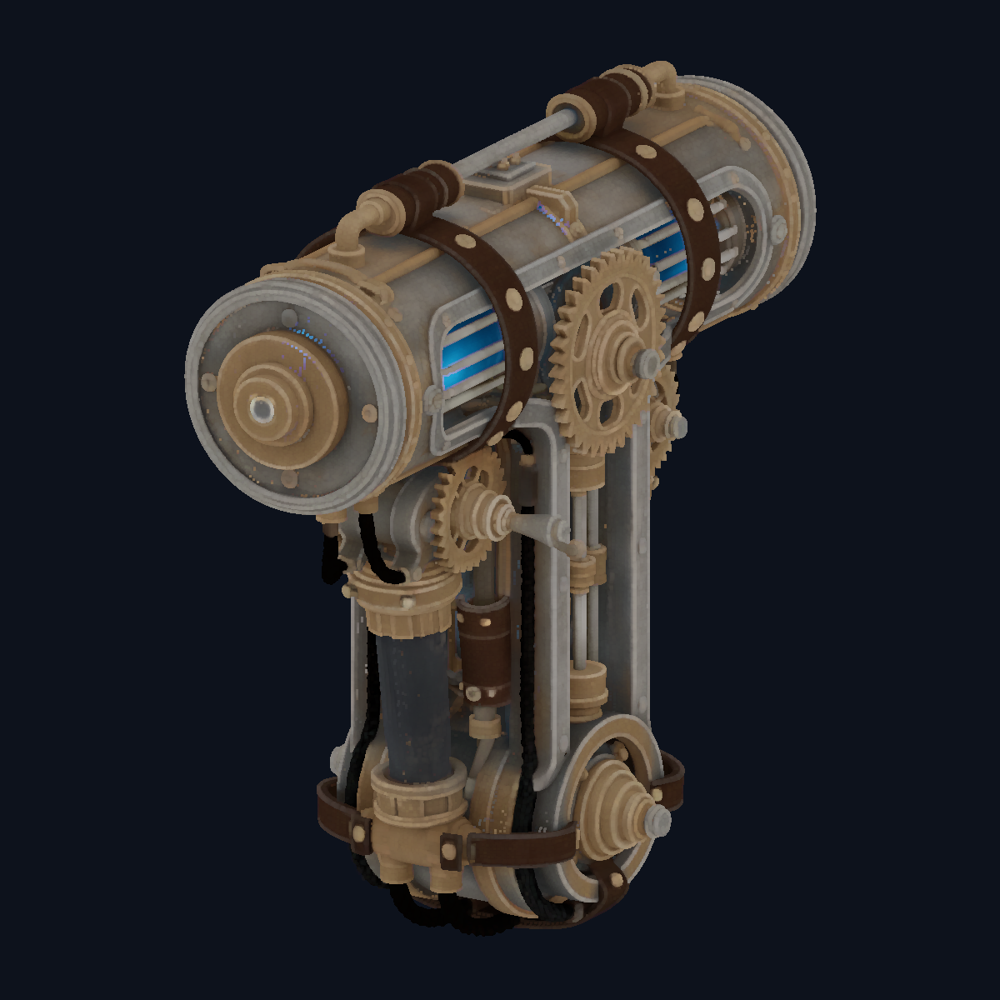
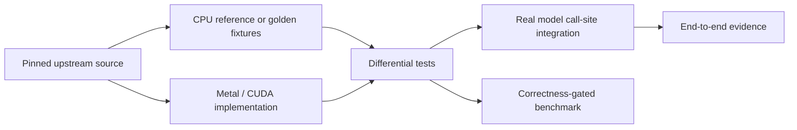

# KernelGoblin

> **Correct first. Fast second. Measured always.**

KernelGoblin is a selective, reproducible harness for translating and
optimizing GPU kernels used by real model repositories. It supports CUDA to
Metal ports, CUDA to CUDA optimizations, and backend-specific experiments
without turning every model dependency into a global prerequisite.

Every port carries its provenance, an exact CPU reference or golden fixture,
real-accelerator differential tests, and a benchmark that checks correctness
before it reports speed.

## Status At A Glance

The first model integration is
[microsoft/TRELLIS.2](https://github.com/microsoft/TRELLIS.2), pinned at
`75fbf0183001ed9876c8dbb35de6b68552ee08bd`.

| Surface | Backend | Status | Strongest evidence |
| --- | --- | --- | --- |
| O-Voxel 3D Morton encode/decode | CPU + native Metal | Verified | Bit-exact differential tests and 65,536 randomized round trips on Apple M3 Pro |
| TRELLIS.2 512 image-to-3D | PyTorch MPS | Verified | Default 12-step run, CPU fallback disabled, reloadable 61.0 MB GLB |
| TRELLIS.2 1024 cascade | Memory-bounded PyTorch MPS | Verified | Default 12-step run, 15.28 GB maximum RSS, reloadable 272.8 MB GLB |
| TRELLIS.2 direct 1024 | PyTorch MPS | Experimental | CLI path exists; no completed default end-to-end claim |
| TRELLIS.2 1536 cascade | PyTorch MPS | Experimental | CLI path exists; no completed default end-to-end claim |
| CUDA UV unwrap / PBR texture bake | CUDA-only upstream path | Not ported | macOS export uses predicted vertex colors instead |

The 1024 result proves correctness and a 36 GB unified-memory fit. It is not a
speed claim: the current reference MPS path took about 51 minutes. A fused
Metal sparse-convolution kernel is the next major optimization target.



<sub>Verified 12-step 1024-cascade geometry, projected directly from the
exported GLB with its predicted vertex colors. This is not the unported CUDA PBR
renderer.</sub>

## Design



The harness is intentionally selective. `./kg setup <kernel>` builds only one
kernel. `./kg model setup <model>` creates only that model's isolated runtime.
Build products, virtual environments, transient checkpoints, and inference
artifacts stay under ignored directories.

## Quick Start

### Native Kernel

Requirements for the current Metal kernel are macOS 13+, Apple Silicon, Xcode
Command Line Tools with Metal, CMake 3.25+, and Ninja.

```sh
./kg doctor
./kg list
./kg validate
./kg setup trellis2/z_order
./kg test trellis2/z_order
./kg benchmark trellis2/z_order
```

Manual CMake equivalents:

```sh
cmake --preset trellis2-z-order
cmake --build --preset trellis2-z-order
ctest --preset trellis2-z-order
```

### TRELLIS.2 On Apple GPU

The model runtime requires macOS on Apple Silicon, Python 3.11, `uv`, and an
authenticated Hugging Face account with access to Meta's DINOv3 checkpoint.
TRELLIS.2's own weights are open; DINOv3 is the separate image-conditioning
encoder referenced by the upstream pipeline and requires accepting Meta's
terms.

```sh
./kg model setup trellis2
./kg model test trellis2

# Verified 512 default
./kg model run trellis2 \
  --input image.png \
  --output build/trellis2/output-512

# Verified memory-bounded 1024 cascade
./kg model run trellis2 \
  --pipeline-type 1024_cascade \
  --input image.png \
  --output build/trellis2/output-1024
```

Allow at least 4 GB of free scratch disk for the largest single checkpoint.
Transient downloads can live on another writable volume:

```sh
KG_TRELLIS2_DOWNLOAD_DIR=/path/to/scratch \
  ./kg model run trellis2 --pipeline-type 1024_cascade \
  --input image.png --output build/trellis2/output-1024
```

The cascade does not load all 12.7 GiB of selected weights at once. It lazily
materializes one component, runs that stage under inference mode, synchronizes
MPS, evicts the component, and clears its temporary download before continuing.
Sparse convolution also chunks neighbor-map construction and matrix products so
decoder temporaries remain bounded.

## What Verified Means

Kernel and model claims are deliberately separate.

The native `trellis2/z_order` test compiles a real `metallib`, dispatches it on
the selected physical Apple GPU, and compares every result bit-for-bit with the
pinned upstream algorithm. Coverage includes empty input, known Morton codes,
all values along each 10-bit axis, boundary values, and 65,536 deterministic
random 3D coordinates.

The model runtime adds call-site conformance for sparse convolution, segmented
attention, sparse grid sampling, dual-grid extraction, mesh export, device
routing, and checkpoint loading. End-to-end success additionally requires:

- non-empty, finite vertices;
- face indices within vertex bounds;
- a GLB that reloads with non-empty geometry;
- exact pinned revisions and artifact SHA-256 values in `evidence.json`;
- physical MPS execution with CPU fallback disabled.

### Measured End-To-End Runs

| Pipeline | Steps | Vertices | Faces | GLB size | Model runtime | Maximum RSS |
| --- | ---: | ---: | ---: | ---: | ---: | ---: |
| `512` | 12 | 1,479,568 | 3,111,374 | 61,010,596 B | 880.588 s | Not recorded |
| `1024_cascade` | 12 | 6,717,817 | 13,774,312 | 272,777,844 B | 3,078.152 s | 15,275,048,960 B |

Both were run on an Apple M3 Pro with PyTorch 2.13.0 MPS and CPU fallback
disabled. See [the full TRELLIS.2 port report](docs/TRELLIS2_PORT.md) for exact
hashes, revisions, limitations, and interpretation.

## Repository Map

| Path | Purpose |
| --- | --- |
| `kg` and `tools/kg.py` | Dependency-free selection, setup, test, benchmark, and model CLI |
| `kernels/<model>/<operation>/` | Independently buildable native kernel ports |
| `ports/<model>/` | Isolated full-model compatibility runtimes and call-site tests |
| `.agents/skills/` | Reusable repository-local Codex workflows |
| `.codex/agents/` | Narrow read-only specialists for explicitly requested parallel work |
| `docs/` | Agent harness, toolchain, and model-port evidence |
| `build/` | Ignored builds, environments, transient weights, and generated evidence |

Each kernel directory owns a `kernel.toml` with its stable ID, operation,
backends, license, exact upstream repository/revision/source paths, supported
input domain, CMake preset, benchmark target, and comparison policy. Adding a
kernel should not require adding it to a second registry.

## Principles

- **Pin before porting.** Every semantic claim traces to exact upstream source.
- **Conformance before optimization.** Preserve behavior first, then tune in an
  attributable change.
- **Execute the real backend.** Compilation alone is never accelerator proof.
- **Correctness-gate benchmarks.** Warmup, synchronization, workload, device,
  and timing boundaries are part of the result.
- **Install only what is selected.** Model packages belong in isolated runtimes,
  not the global environment.
- **State the gap.** Unsupported rendering, hardware, pipeline, or performance
  work remains explicit rather than implied by a nearby success.

## Agentic Development

Codex contributors start with [`AGENTS.md`](AGENTS.md). The repository-local
`$port-gpu-kernel` skill, specialist roles, verification ladder, trust model,
and tool inventory are documented in
[`docs/AGENT_HARNESS.md`](docs/AGENT_HARNESS.md) and
[`docs/TOOLS.md`](docs/TOOLS.md).

The primary agent owns edits and final verification. Subagents are reserved for
explicitly requested, bounded read-only research or review. `./kg validate`
mechanically checks kernel manifests, agent roles, the local skill, and required
harness files.

## Upstream And License

- TRELLIS.2 repository: [microsoft/TRELLIS.2](https://github.com/microsoft/TRELLIS.2)
- Pinned integration revision: `75fbf0183001ed9876c8dbb35de6b68552ee08bd`
- First translated sources: `o-voxel/src/serialize/z_order.{cu,h}`
- KernelGoblin license: [MIT](LICENSE)
- Third-party provenance: [THIRD_PARTY_NOTICES.md](THIRD_PARTY_NOTICES.md)

The translated algorithm remains covered by Microsoft's upstream MIT license.
