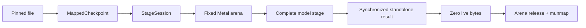

# Native TRELLIS.2 On Apple Silicon

## The Boundary

KernelGoblin's production Apple runtime is Swift, Metal, and Apple system
frameworks. Installing weights and running TRELLIS.2 does not require Python,
PyTorch, MLX, the PyTorch MPS allocator, or an external Swift package.

Python and Torch remain available under `ports/trellis2/` as an explicitly
named, isolated oracle. They produce authenticated fixtures and reference
artifacts. They are not a hidden fallback.

This boundary is machine-readable in `ports/trellis2/model.toml` and enforced
in two places:

- `./kg validate` checks native roots, allowed file types, import allowlists,
  forbidden bridges, manifests, agent roles, and the checked-in porting skill.
- `./kg model native-audit trellis2` builds the release executable, requires an
  empty SwiftPM dependency graph, and audits Mach-O linkage.

KernelGoblin remains a multi-backend repository. Future CUDA-to-CUDA kernels
can use their native toolchain without becoming a dependency of this Apple
runtime.

## Why Native

The Torch/MPS oracle proved the graph can run, but its ownership model is not
what we want for a smaller-memory Mac. Native code lets us:

- memory-map one authenticated checkpoint and wrap it with
  `MTLBuffer(bytesNoCopy:)`;
- avoid a second weight-sized CPU heap copy during loading;
- allocate stage scratch from a Metal heap with a hard capacity;
- synchronize and destroy a complete stage at an explicit boundary;
- record capacity, live, peak, cumulative-requested, and allocation-count
  metrics separately; and
- ship one native executable.

## What We Borrowed From Turbo Fieldfare

[`drumih/turbo-fieldfare`](https://github.com/drumih/turbo-fieldfare) revision
`1859181ae26eb39c9698437f806be62adc01367c` is an excellent example of disciplined
file-backed Metal ownership. We adopted the ideas that fit TRELLIS:

1. Pin requested and resolved revisions.
2. Authenticate every accepted file and write a receipt.
3. Map weights instead of materializing a second checkpoint.
4. Reuse bounded scratch and reject overflow.
5. Finish queued Metal work before releasing ownership.
6. Report disk, mapping, process, and Metal allocation numbers as different
   quantities.

We did not adopt its routed-expert SSD cache. TRELLIS stages are dense and use
every block on every denoising step. Reading a stage layer-by-layer twelve times
would trade a memory problem for repeated I/O.

## Installed Layout

The installer accepts `generate`, `texture`, or `all` and stores one directory
per role:

```text
~/Library/Application Support/KernelGoblin/trellis2-512/
  install.json
  dino/model.safetensors
  sparse-structure-flow/ss_flow_img_dit_1_3B_64_bf16.safetensors
  sparse-structure-decoder/ss_dec_conv3d_16l8_fp16.safetensors
  shape-flow/slat_flow_img2shape_dit_1_3B_512_bf16.safetensors
  texture-flow/slat_flow_imgshape2tex_dit_1_3B_512_bf16.safetensors
  shape-encoder/shape_enc_next_dc_f16c32_fp16.safetensors
  shape-decoder/shape_dec_next_dc_f16c32_fp16.safetensors
  texture-decoder/tex_dec_next_dc_f16c32_fp16.safetensors
```

If an exact file already exists in the Hugging Face cache, the installer
validates its byte count and SHA-256 and creates a symlink. Otherwise it
downloads to a temporary file, checks size and hash, and atomically moves the
accepted file into place. A partial file is never an installation.

`install.json` records format, runtime, timestamp, role, repository, revision,
path, bytes, and SHA-256. The current all-feature set is about 11.7 GB.

## Runtime Ownership



`MappedCheckpoint` validates safetensors ranges and owns the file mapping.
`MetalContext` owns the device, command queue, compiled kernels, and optional
heap-backed arena. `StageSession` owns both plus the model graph for exactly one
checkpoint lifetime.

A stage may return only a standalone semantic result: conditioning tokens,
sparse occupancy, latent values, coordinates/guides, decoded fields, or a mesh.
Before close returns, the session:

1. waits for Metal and checks command status;
2. verifies that the arena has zero live bytes;
3. detaches and releases the arena;
4. verifies the arena object is actually gone; and
5. closes the checkpoint mapping.

Lifecycle tests observe queue drain, arena release, and checkpoint unmap in
that order, including body and initialization error paths.

## Coordinator Shape

Image-to-3D stages:

```text
image prep
  -> DINOv3
  -> sparse structure flow
  -> occupancy decoder/extraction
  -> shape flow
  -> texture flow
  -> shape decoder + flexible-dual-grid mesh + hole fill
  -> texture decoder
  -> UV preparation + Metal PBR export + GLB reload
```

Existing-mesh texturing stages:

```text
Model I/O load + normalization + UV preparation
  -> native flexible-dual-grid voxelizer
  -> exact six-channel shape-encoder handoff
  -> DINOv3
  -> shape encoder
  -> texture flow
  -> guided texture decoder
  -> Metal PBR export + GLB reload
```

The production granularity is a whole stage, not a transformer layer. A 2.58 GB
flow checkpoint is opened once, used for every Euler/CFG call, and then closed.

## Native Model Building Blocks

The Swift package contains:

- a strict safetensors parser and SHA-256 file reader;
- dense BF16/F16/F32 projection, normalization, activation, RoPE, attention,
  and sampler kernels;
- deterministic sparse neighborhood, convolution, spatial-to-channel, and
  channel-to-spatial topology;
- complete DINOv3, sparse-structure, SLat flow, shape encoder, shape decoder,
  and guided texture decoder graphs;
- native image preprocessing with an Apple Vision foreground-mask policy;
- a pure Swift O-Voxel flexible-dual-grid voxelizer and mesh builder;
- topology-safe hole filling and UV preparation;
- Metal UV rasterization and sparse half-voxel PBR sampling;
- OpenCV-compatible Telea texture filling; and
- embedded-PNG glTF/GLB writing plus independent reload validation.

Every real-checkpoint stage has authenticated oracle coverage. Full graph tests
use deliberately small topology where needed; those are graph/conformance
proofs, not representative performance claims.

## Memory Budgets

Default capacities are conservative ceilings, not preallocated resident bytes:

| Stage | Default capacity |
| --- | ---: |
| DINOv3 | 256 MiB |
| Sparse structure flow | 640 MiB |
| Sparse structure decoder | 320 MiB |
| Shape flow | 4 GiB |
| Texture flow | 4 GiB |
| Shape encoder | 6 GiB |
| Shape decoder | 6 GiB |
| Texture decoder | 6 GiB |
| PBR export | 512 MiB |

The heap commits pages as used. Evidence records actual arena peaks and verifies
zero live ownership after close. `--max-stage-memory-gib` can lower the large
stage ceilings; exceeding the cap fails loudly.

The verified existing-mesh run peaked at roughly 937 MB in the shape encoder,
850 MB in the texture decoder, 273 MB in texture flow, and 201 MB in PBR export.
Its process maximum RSS was 3.04 GB with zero swaps. These are one device and
one workload, not a universal minimum-memory promise.

## Reproducibility Contract

Native random noise uses SplitMix64 and Box-Muller with fixed implementation
details recorded in evidence. A native seed reproduces native runs, but it does
not claim PyTorch generator identity.

Each successful artifact evidence file records:

- upstream source and weight revisions;
- runtime, device, and operating system;
- input and output hashes;
- preprocessing and alpha policy;
- seed, noise algorithm, steps, and token counts;
- geometry, UV implementation/fingerprint, texture coverage, and GLB reload;
- per-stage checkpoint hashes, elapsed time, and memory-ledger values.

## Verification And Performance Rules

The implementation order remains:

1. Pin source and capture the real call contract.
2. Preserve or export an independent oracle.
3. Port behavior before tuning.
4. Execute the physical Metal backend.
5. Verify full stages and lifecycle boundaries.
6. Run and reload representative artifacts.
7. Benchmark only after correctness passes.

CUDA fixtures remain valuable, but nvdiffrast source is not translated or
redistributed. The Metal UV rasterizer is an independent implementation of the
public behavior contract. Differences from CuMesh, RMBG, PyTorch RNG, and BF16
reduction order are recorded in `TRELLIS2_PORT.md` rather than hidden behind a
single "parity" label.
