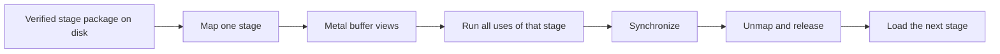

# Native TRELLIS.2 On Apple Silicon

## The Decision

The production Apple runtime will be Swift and Metal. It will not require
Python, PyTorch, or the PyTorch MPS allocator to install weights or run a
model. The current Torch/MPS port remains an optional, pinned correctness
oracle until native outputs match it.

This boundary applies to the Apple model runtime. KernelGoblin still supports
isolated C++ and CUDA targets because CUDA-to-CUDA optimization is part of the
repository's broader mission. Geometry may use small pinned native libraries
such as xatlas and Eigen through Swift C++ interoperability where replacing a
mature algorithm would add risk without improving the runtime contract.

## Why Native

PyTorch proved that the TRELLIS.2 graph and open checkpoints can execute on
MPS, but it cannot expose the ownership model we want. A native runtime can:

- map a packed stage file and wrap aligned memory with
  `MTLBuffer(bytesNoCopy:)`;
- avoid simultaneous random model parameters, state-dictionary tensors, and
  copied MPS parameters during load;
- own reusable scratch buffers with hard capacity limits;
- synchronize and destroy a complete stage at an explicit lifecycle boundary;
- record true Metal buffer, process footprint, mapped-file, and scratch sizes
  separately; and
- ship as one native executable without a Python environment.

## What We Learned From Turbo Fieldfare

[`drumih/turbo-fieldfare`](https://github.com/drumih/turbo-fieldfare) at
revision `1859181ae26eb39c9698437f806be62adc01367c` demonstrates disciplined
file-backed Metal ownership on small-memory Macs. Its most useful ideas for
TRELLIS.2 are the installer and lifecycle contracts:

1. Pin the requested and resolved model revision.
2. Repack through bounded scratch and never materialize a second checkpoint.
3. Hash every accepted file and write a verified-install receipt.
4. Map stage weights without a CPU heap copy.
5. Reuse fixed scratch; reject oversized work rather than growing silently.
6. Finish queued Metal work before releasing the current stage.
7. Report disk, virtual mapping, resident memory, and Metal allocations as
   different quantities.

Its routed-expert cache is intentionally **not** part of this design. Gemma 4
selects a small subset of experts for each token. TRELLIS.2 stages are dense
and reuse every block for every denoising step. Streaming each layer from SSD
would reread almost an entire stage twelve times in a default run. The correct
granularity here is a whole model stage.

## Runtime Shape



For 512 image-to-3D, the stages are image conditioning, sparse structure flow,
sparse structure decoding, shape flow, texture flow, shape decoding, texture
decoding, and PBR baking. Existing-mesh texturing starts with the CPU
mesh-to-flexible-dual-grid conversion, then runs shape encoding, image
conditioning, texture flow, texture decoding, and the same PBR baker.

## Package Format

Source safetensors remain the provenance root. Installation will convert each
component into a page-aligned `KGSTAGE` package:

```text
trellis2-native/
  install.json
  stages/
    shape-flow-512/
      manifest.json
      weights.bin
    texture-flow-512/
      manifest.json
      weights.bin
    ...
```

The manifest records the model, component, source repository and exact
revision, file size, SHA-256, dtype, tensor shape, packed offset, and layout.
The installer copies tensor bytes unchanged unless a separately versioned
quantization format is selected. A partial directory is never accepted as an
installation.

## Verification Strategy

Native work lands in vertical slices rather than as an untestable rewrite:

1. Parse and validate real safetensors metadata in Swift.
2. Pack and map one real checkpoint tensor without a heap-sized copy.
3. Run one dense layer from a hash-verified real checkpoint in Metal and
   compare every output with an independent CPU oracle.
4. Add normalization, activation, attention, and sparse primitives with
   differential fixtures.
5. Reproduce one complete model block.
6. Reproduce one complete stage.
7. Run 512 image-to-3D and mesh texturing end to end.
8. Only then retire Torch from the default setup and run commands.

CUDA parity fixtures remain valuable, but nvdiffrast source is not translated
or redistributed. The Metal UV rasterizer is an independent implementation of
the public behavior contract.

## First Native Vertical Slice

The first production-weight TRELLIS slice is now executable without Python or
Torch:

```sh
swift run -c release kg-trellis2 \
  verify-slat-input-layer /path/to/slat_flow_img2shape_dit_1_3B_512_bf16.safetensors
```

It validates the complete safetensors range table, maps 2.584 GB into Metal
without a heap-sized weight copy, hashes that exact mapping against the pinned
checkpoint SHA-256, and
executes `input_layer` for deterministic input `[17,32]`. Metal widens the
stored BF16 `[1536,32]` weight and bias to F32 arithmetic. All 26,112 F32
outputs are compared with a CPU calculation and then compared bit-for-bit
after round-to-nearest-even BF16 conversion.

This is one real model layer, not a complete model stage. The next acceptance
boundary is timestep embedding, F32 normalization, adaLN modulation, and one
complete cross-transformer block.
