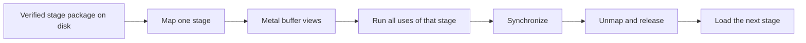

# Native TRELLIS.2 On Apple Silicon

## The Decision

The production Apple runtime will be Swift and Metal. It will not require
Python, PyTorch, or the PyTorch MPS allocator to install weights or run a
model. The current Torch/MPS port remains an optional, pinned correctness
oracle until native outputs match it.

This boundary applies to the Apple model runtime. KernelGoblin still supports
isolated C++ and CUDA targets because CUDA-to-CUDA optimization is part of the
repository's broader mission. Geometry may use small pinned native libraries
such as xatlas and Eigen through Swift C++ interoperability where replacing a
mature algorithm would add risk without improving the runtime contract.

`ports/trellis2/model.toml` makes the boundary machine-readable. It declares
the native source roots, their allowed Swift/Metal file types, forbidden
Python/Torch bridge imports, and the current empty external Swift-package
dependency set. `./kg validate` enforces fixed source and import allowlists;
`./kg model native-audit trellis2` additionally builds the release executable,
requires an empty resolved SwiftPM dependency graph, and audits its Mach-O
linkage. If a small native geometry dependency is eventually accepted, it must
be pinned, attributed, declared there, and must not pull Python or Torch into
installation or runtime.

## Why Native

PyTorch proved that the TRELLIS.2 graph and open checkpoints can execute on
MPS, but it cannot expose the ownership model we want. A native runtime can:

- map a packed stage file and wrap aligned memory with
  `MTLBuffer(bytesNoCopy:)`;
- avoid simultaneous random model parameters, state-dictionary tensors, and
  copied MPS parameters during load;
- own reusable scratch buffers with hard capacity limits;
- synchronize and destroy a complete stage at an explicit lifecycle boundary;
- record true Metal buffer, process footprint, mapped-file, and scratch sizes
  separately; and
- ship as one native executable without a Python environment.

## What We Learned From Turbo Fieldfare

[`drumih/turbo-fieldfare`](https://github.com/drumih/turbo-fieldfare) at
revision `1859181ae26eb39c9698437f806be62adc01367c` demonstrates disciplined
file-backed Metal ownership on small-memory Macs. Its most useful ideas for
TRELLIS.2 are the installer and lifecycle contracts:

1. Pin the requested and resolved model revision.
2. Repack through bounded scratch and never materialize a second checkpoint.
3. Hash every accepted file and write a verified-install receipt.
4. Map stage weights without a CPU heap copy.
5. Reuse fixed scratch; reject oversized work rather than growing silently.
6. Finish queued Metal work before releasing the current stage.
7. Report disk, virtual mapping, resident memory, and Metal allocations as
   different quantities.

Its routed-expert cache is intentionally **not** part of this design. Gemma 4
selects a small subset of experts for each token. TRELLIS.2 stages are dense
and reuse every block for every denoising step. Streaming each layer from SSD
would reread almost an entire stage twelve times in a default run. The correct
granularity here is a whole model stage.

## Runtime Shape



For 512 image-to-3D, the stages are image conditioning, sparse structure flow,
sparse structure decoding, shape flow, texture flow, shape decoding, texture
decoding, and PBR baking. Existing-mesh texturing starts with the CPU
mesh-to-flexible-dual-grid conversion, then runs shape encoding, image
conditioning, texture flow, texture decoding, and the same PBR baker.

## Package Format

Source safetensors remain the provenance root. Installation will convert each
component into a page-aligned `KGSTAGE` package:

```text
trellis2-native/
  install.json
  stages/
    shape-flow-512/
      manifest.json
      weights.bin
    texture-flow-512/
      manifest.json
      weights.bin
    ...
```

The manifest records the model, component, source repository and exact
revision, file size, SHA-256, dtype, tensor shape, packed offset, and layout.
The installer copies tensor bytes unchanged unless a separately versioned
quantization format is selected. A partial directory is never accepted as an
installation.

## Verification Strategy

Native work lands in vertical slices rather than as an untestable rewrite:

1. Parse and validate real safetensors metadata in Swift.
2. Pack and map one real checkpoint tensor without a heap-sized copy.
3. Run one dense layer from a hash-verified real checkpoint in Metal and
   compare every output with an independent CPU oracle.
4. Add normalization, activation, attention, and sparse primitives with
   differential fixtures.
5. Reproduce one complete model block.
6. Reproduce one complete stage.
7. Run 512 image-to-3D and mesh texturing end to end.
8. Only then retire Torch from the default setup and run commands.

CUDA parity fixtures remain valuable, but nvdiffrast source is not translated
or redistributed. The Metal UV rasterizer is an independent implementation of
the public behavior contract.

## First Native Vertical Slice

The first production-weight TRELLIS slice is now executable without Python or
Torch:

```sh
swift run -c release kg-trellis2 \
  verify-slat-input-layer /path/to/slat_flow_img2shape_dit_1_3B_512_bf16.safetensors
```

It validates the complete safetensors range table, maps 2.584 GB into Metal
without a heap-sized weight copy, hashes that exact mapping against the pinned
checkpoint SHA-256, and
executes `input_layer` for deterministic input `[17,32]`. Metal widens the
stored BF16 `[1536,32]` weight and bias to F32 arithmetic. All 26,112 F32
outputs are compared with a CPU calculation and then compared bit-for-bit
after round-to-nearest-even BF16 conversion.

The second native slice executes the pinned timestep sinusoid, both real
BF16-stored MLP projections with SiLU, and the shared adaLN projection to 9,216
channels. At timestep `650.25`, maximum F32 error was `4.77e-6` and every
round-to-nearest-even BF16 output bit matched the CPU oracle.

The third slice executes one complete production-weight cross-transformer
block: LayerNorm32, adaptive modulation, 3D RoPE, fused self-attention, affine
normalization, fused cross-attention, the 1,536 -> 8,192 -> 1,536 GELU MLP, and
both gated residuals. Its fixture comes from the pinned upstream Torch CPU
implementation. The two-token fixture exercises real self-attention scoring.
On Apple M3 Pro, every final value was finite, maximum absolute error was
`0.25`, and RMS error was `0.0174691` over 3,072 outputs. Intermediate fixtures
cover every sub-block boundary so a later regression cannot be hidden by the
final tolerance.

The fourth slice carries that block through the complete production shape-flow
stage. It maps the pinned 2.58 GB checkpoint and executes the real input layer,
timestep MLP, shared adaLN, all 30 RoPE cross-transformer blocks, final
LayerNorm, and output layer on Metal. Against the pinned two-token Torch oracle,
final maximum error is `0.01557` and RMS error is `0.00615` over 64 F32 values.
The tiny fixture covers every stage weight and operation, but it does not stand
in for representative sparse-token memory or performance evidence.

The fifth slice reuses that graph for the separate production texture-flow
checkpoint and its 64-channel noise-plus-normalized-shape input. Both flows now
run repeatedly through native Swift Euler orchestration. Two-step immutable
fixtures capture every model prediction and sampler state. The texture
trajectory stays within `0.00621` normalized final RMS; the shape fixture also
reports the larger deterministic CFG trajectory drift instead of hiding it
behind the single-stage tolerance.

Flow and sampler temporaries can now be allocated from a heap-backed Metal
arena. The arena enforces a hard capacity, rejects oversized requests, and
reports current heap use, peak heap use, cumulative allocation traffic, and
the current device-allocation gauge separately. Tiny sampler integrations peak
below 352 KB, which validates bounded allocation and reuse only. It is not a
representative 512 memory claim, and synchronized checkpoint-plus-heap stage
release remains to be proven.

The attention primitive now carries explicit segment offsets and rejects
cross-sample attention as well as unsafe output/key/value aliases. The complete
block contract remains batch one until timestep modulation also carries a
per-token batch map. The correctness-first attention algorithm is still
quadratic in work; a tiled implementation and a captured production coordinate
set are required before representative speed and memory gates can pass.

We evaluated MLX Steel, ccv MFA, llama.cpp, vllm-metal, and Philip Turner's
Swift `metal-flash-attention` at pinned revisions. We did not add any as a
runtime dependency. The Swift package is elegant but exposes a single-head,
non-varlen contract, lacks BF16 Q/K/V, and its private async-copy assembly does
not compile with the current Xcode Metal compiler. ccv MFA is the closest
semantic source because it already carries packed signed-Int32 query and
key/value offsets. The planned optimization is a narrow attributed port of its
forward varlen tiling, not a dependency on ccv's full C++ runtime. The existing
online-softmax kernel remains the independent oracle and fallback.

## Complete Native DINOv3 Stage

Image conditioning now has a complete production-resolution model stage. The
native graph validates the gated checkpoint hash and every required tensor,
then executes ViT-L/16 patch embedding, CLS plus four register tokens, dynamic
two-dimensional RoPE, 24 transformer blocks, exact-semantic GELU, LayerScale,
and TRELLIS's parameter-free final LayerNorm. A 512-square input produces all
1,029 tokens of width 1,024.

The physical-Metal test compares the complete output with an immutable F32
fixture generated from the pinned TRELLIS and DINO revisions. Maximum absolute
error is `5.2928925e-5` and RMS error is `1.9124438e-6`. On the Apple M3 Pro
verification host, the model graph took 2.23 seconds and the hard-bounded arena
peaked at 75,866,112 bytes. Metal compilation explicitly enables fast math;
the full-output tolerance captures the resulting reduction and transcendental
differences rather than pretending cross-backend values are bit-exact.

This is a model-stage result, not raw-image-to-conditioning proof. The fixture
begins with an exact normalized NCHW tensor. Native parity for image decode,
alpha-aware preprocessing, Lanczos resize, RGB quantization, and ImageNet
normalization remains a separate acceptance gate. The result also remains
arena-backed until the synchronized `StageSession` lifecycle is complete, so
the current peak number is not yet a stage-release claim.
