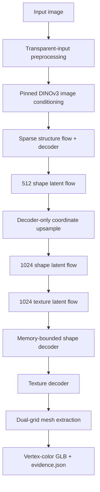

# TRELLIS.2 Apple GPU Port

> A correctness-first, memory-bounded TRELLIS.2 inference runtime for Apple
> Silicon. Verified at 512 and 1024 cascade resolution on an Apple M3 Pro.

| Item | Pinned value |
| --- | --- |
| Upstream | [microsoft/TRELLIS.2](https://github.com/microsoft/TRELLIS.2) |
| Source revision | `75fbf0183001ed9876c8dbb35de6b68552ee08bd` |
| TRELLIS.2-4B weights | `af44b45f2e35a493886929c6d786e563ec68364d` |
| TRELLIS image decoder | `25e0d31ffbebe4b5a97464dd851910efc3002d96` |
| DINOv3 encoder | `ea8dc2863c51be0a264bab82070e3e8836b02d51` |
| Verified host | Apple M3 Pro, macOS 26.5.2, 36 GB unified memory |
| Verified framework | PyTorch 2.13.0 MPS, CPU fallback disabled |

## Executive Summary

Upstream TRELLIS.2 targets Linux, NVIDIA GPUs with at least 24 GB VRAM, CUDA
12.4, and several CUDA-specific libraries. KernelGoblin supplies an isolated
macOS compatibility runtime for:

- the default 512 image-to-3D pipeline;
- the stage-wise 1024 cascade pipeline;
- the inference-facing portions of O-Voxel, FlexGEMM, CuMesh, sparse attention,
  and sparse convolution required by those paths.

Both verified pipelines complete their upstream-default 12 sampling steps,
produce non-empty finite geometry, export a GLB, and reload that GLB with exact
vertex and face counts. The 1024 cascade peaks at 15.28 GB RSS and fits on the
36 GB test machine.

This is a correctness and memory-fit milestone, not a production-speed claim.
The 1024 run takes about 51 minutes because sparse convolution is still an
unfused, chunked PyTorch MPS reference implementation.

## Runtime Architecture



Cascade model boxes are not resident together. Each box materializes lazily,
runs under `torch.inference_mode()`, synchronizes MPS, and is evicted before the
next large component loads.

## Port Matrix

| Area | Apple runtime status | Current verification |
| --- | --- | --- |
| O-Voxel Z-order encode/decode | Complete native Metal kernel | Bit-exact CPU/Metal differential and round-trip tests on physical Apple GPU |
| Sparse submanifold convolution | Complete for inference shapes with bounded chunks | Dense-reference parity, including forced multi-chunk execution, on CPU and MPS |
| Full and windowed sparse attention | Segmented PyTorch SDPA implementation | Independent SDPA references and window-isolation tests on CPU/MPS |
| FlexGEMM sparse grid sampling | Nearest and trilinear inference semantics | Hand-computed fixtures, boundary checks, and CPU/MPS comparison |
| O-Voxel lookup and dual-grid extraction | Complete for inference extraction | Missing-key, bounds, grid-size, and known-quad fixtures on CPU/MPS |
| Device abstraction | Complete for verified paths | MPS routing tests and end-to-end CPU-fallback-disabled evidence |
| Checkpoint loading | Pinned, strict, lazy, and streaming | Missing/unexpected key rejection; only deterministic `rope_phases` is allowlisted |
| Checkpoint cleanup | One component at a time | Temporary safetensors and Hugging Face local-dir cache removed in `finally` |
| Mesh cleanup | Portable CPU fallback | GLB fixture and basic Trimesh hole filling |
| Portable export | Predicted RGBA vertex colors | Finite/non-empty/index-safe checks plus GLB reload |
| Full 512 pipeline | Verified | Default 12 steps, 1,479,568 vertices, 3,111,374 faces |
| Full 1024 cascade | Verified | Default 12 steps, 6,717,817 vertices, 13,774,312 faces, 15.28 GB maximum RSS |
| Direct 1024 pipeline | Experimental | Exposed in CLI; no completed default end-to-end claim |
| 1536 cascade | Experimental | Exposed in CLI; no completed default end-to-end claim |
| CUDA UV unwrap / texture bake | Not ported | No parity claim with CuMesh UV unwrap or nvdiffrast rendering |
| Training and backward passes | Not ported | Inference only |

## Why DINOv3 Is Required

TRELLIS.2's generative weights are open. The upstream pipeline separately uses
[`facebook/dinov3-vitl16-pretrain-lvd1689m`](https://huggingface.co/facebook/dinov3-vitl16-pretrain-lvd1689m)
to encode the input image into conditioning features. Meta gates that checkpoint
behind acceptance of its terms and contact-information sharing.

KernelGoblin does not automate that owner-controlled acceptance. The CLI first
checks a small DINOv3 file, before downloading TRELLIS weights, and provides a
focused error if access is missing or awaiting review.

Optional opaque-background removal uses `briaai/RMBG-2.0` pinned at
`5df4c9c76d8170882c34f6986e848ee07fd0ba43`. It is gated and licensed CC BY-NC
4.0. A useful alpha channel bypasses RMBG entirely.

## Installation And Access

Requirements:

- macOS on Apple Silicon;
- Python 3.11;
- [`uv`](https://docs.astral.sh/uv/);
- Hugging Face authentication with approved DINOv3 access;
- at least 4 GB of writable scratch space for one transient checkpoint;
- enough output space for the selected GLB.

```sh
hf auth login
./kg model setup trellis2
./kg model test trellis2
```

Setup clones only the pinned upstream revision into `build/trellis2/upstream`,
creates `build/trellis2/.venv`, installs the pinned inference requirements, and
copies in the selected MPS sparse-convolution backend. It does not alter global
Python packages.

## Running Inference

Verified 512 path:

```sh
./kg model run trellis2 \
  --input build/trellis2/upstream/assets/example_image/T.png \
  --output build/trellis2/e2e-512
```

Verified memory-bounded 1024 cascade:

```sh
./kg model run trellis2 \
  --pipeline-type 1024_cascade \
  --input build/trellis2/upstream/assets/example_image/T.png \
  --output build/trellis2/e2e-1024
```

Useful controls:

| Control | Meaning |
| --- | --- |
| `--steps N` | Override all three sampler step counts; useful for failure-finding smoke tests |
| `--seed N` | Set deterministic generation seed; default is `42` |
| `--no-preprocess` | Bypass background removal and all preprocessing |
| `--pipeline-type` | Select `512`, `1024`, `1024_cascade`, or `1536_cascade` |
| `KG_TRELLIS2_DOWNLOAD_DIR` | Put transient checkpoint downloads on another writable filesystem |

Example with external scratch space:

```sh
KG_TRELLIS2_DOWNLOAD_DIR=/Volumes/FastScratch/trellis2 \
  ./kg model run trellis2 --pipeline-type 1024_cascade \
  --input image.png --output build/trellis2/output-1024
```

## How 1024 Fits In 36 GB

The selected cascade checkpoints total roughly 12.66 GiB before DINOv3,
allocator state, activations, sparse topology, and export copies. Unified memory
is also shared with macOS and every other application. Loading the full cascade
eagerly is therefore the wrong memory model.

KernelGoblin uses four complementary controls:

1. **Lazy component materialization.** Pipeline construction creates reloadable
   proxies rather than loading every checkpoint.
2. **One-way stage eviction.** Flow and decoder components are synchronized,
   moved off MPS, deleted, garbage-collected, and cache-cleared as soon as their
   last consumer finishes.
3. **Inference-only graph lifetime.** The manual cascade runs inside
   `torch.inference_mode()` so latent tensors cannot retain transformer weights
   and activations through autograd graphs.
4. **Bounded sparse convolution.** Neighbor maps use int32 source indices and
   are constructed in row chunks. Each kernel-offset matrix product is also
   row-chunked, avoiding full `N x output_channels` temporaries.

The one-step smoke test peaked at 19.62 GB RSS. The higher-quality 12-step run
peaked at 15.28 GB RSS. Different sampled topology and allocator behavior can
change the peak, so 36 GB is verified hardware, not a universal minimum claim.

## End-To-End Evidence

### 512 Default, 12 Steps

| Field | Value |
| --- | --- |
| Input SHA-256 | `db468bad8a04f1474a8d68140c07501b013b3ec6124b911fb7852675d64c05ee` |
| Output SHA-256 | `12fc1446c0f0472874588b381643e351960163a6ded98fd43878a4fcffce3c31` |
| Geometry | 1,479,568 vertices; 3,111,374 faces |
| GLB size | 61,010,596 bytes |
| Model runtime | 880.588 seconds, including streamed downloads and loading |
| Output | `build/trellis2/e2e-default/trellis2-512.glb` |
| Evidence | `build/trellis2/e2e-default/evidence.json` |

### 1024 Cascade Default, 12 Steps

| Field | Value |
| --- | --- |
| Input SHA-256 | `db468bad8a04f1474a8d68140c07501b013b3ec6124b911fb7852675d64c05ee` |
| Output SHA-256 | `e970affbd104decf77289bfacde745c96ce8961e6e7b57874f07a6b2d423792a` |
| Geometry | 6,717,817 vertices; 13,774,312 faces |
| GLB size | 272,777,844 bytes |
| Model runtime | 3,078.152 seconds |
| Maximum RSS | 15,275,048,960 bytes from `/usr/bin/time -l` |
| Process swaps | 0 from `/usr/bin/time -l` |
| Output | `build/trellis2/e2e-1024-cascade-default/trellis2-1024_cascade.glb` |
| Evidence | `build/trellis2/e2e-1024-cascade-default/evidence.json` |

Both GLBs reloaded with exact generated vertex and face counts. Vertices were
finite, face indices were in range, and CPU fallback remained disabled. The 512
preview showed coherent colored geometry corresponding to the input object. A
one-step result is retained only as failure-finding evidence, not as a
model-quality substitute for the default sampler.


The preview is an orthographic point projection of the validated GLB's own
vertices and predicted RGBA values. It is deliberately not presented as output
from upstream's CUDA-only PBR renderer.

## Performance Interpretation

Upstream's optimized CUDA stack is the performance target. The current Apple
runtime deliberately reaches correctness through portable PyTorch MPS
operations, segmented SDPA, and memory-bounded loops. On the verified 1024 run:

- sparse structure sampling took about 1 minute 47 seconds for 12 steps;
- 512 shape sampling took about 1 minute 40 seconds for 12 steps;
- 1024 shape sampling took about 17 minutes 37 seconds for 12 steps;
- 1024 texture sampling took about 9 minutes 15 seconds for 12 steps;
- downloads, decoder passes, mesh extraction, cleanup, export, and validation
  made up the remaining time.

Those numbers identify optimization targets. They should not be generalized to
other Macs, inputs, seeds, resolutions, or future fused kernels.

## Output Parity Boundary

The macOS exporter samples TRELLIS-predicted base color and alpha onto vertices
and writes a portable vertex-color GLB. Geometry and predicted color survive the
round trip.

It does **not** perform upstream's CUDA-only UV unwrapping, nvdiffrast material
bake, or CUDA renderer. The artifact is useful and validated, but visual parity
with upstream's full PBR texture-baking path is not claimed.

## Troubleshooting

| Symptom | Meaning and action |
| --- | --- |
| DINOv3 gated-repository error | Accept Meta's DINOv3 terms, wait for approval if required, then run `hf auth login` |
| RMBG access error on opaque input | Accept RMBG-2.0 terms or provide a transparent input / use `--no-preprocess` |
| `No space left on device` | Free at least 4 GB or set `KG_TRELLIS2_DOWNLOAD_DIR` to a writable volume |
| Immediate MPS unavailable error | Run on Apple Silicon with a PyTorch build that includes MPS support |
| Slow 1024 progress | Expected for the current unfused reference path; progress may pause while an asynchronous Metal operation finishes |
| OS kill during custom development | Check inference mode, stage eviction, MPS synchronization, and sparse temporary sizes before assuming model weights are the peak |

## Remaining Work

1. Fuse the reference sparse-convolution neighbor lookup and accumulation into
   native Metal while preserving exact conformance fixtures.
2. Profile full/windowed attention and high-resolution flow call sites after
   sparse convolution is no longer the dominant reference path.
3. Add a Metal-compatible UV unwrap and texture-baking backend only if full PBR
   texture maps are a product requirement.
4. Verify direct 1024 and the 1536 cascade independently before changing their
   experimental status.
5. Keep training, backward passes, Hilbert serialization, and CUDA rendering
   outside the verified surface until each has its own tests and evidence.
