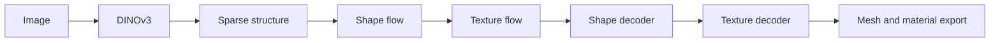
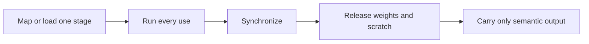

# TRELLIS.2 On Apple Silicon

> The honest record of what ran, what it proved, and what still has to earn the
> word "ported."

## The Short Version

We have run the pinned TRELLIS.2 512 and 1024-cascade image-to-3D graphs on an
Apple M3 Pro through a Torch/MPS reference runtime. The 1024 result fit in
15.28 GB maximum RSS and produced a reloadable 272.8 MB GLB. It also took about
51 minutes, which is why that runtime is now an oracle rather than the product.

The production Apple port is **Swift + Metal with no Torch dependency**. It
already validates and memory-maps real safetensors files, owns bounded Metal
scratch, executes both complete TRELLIS SLat flows through native samplers, and
includes native Morton and UV-raster kernels. Full native DINO, sparse
structure, decoding, upstream-faithful PBR export, and existing-mesh texturing
remain in progress.

That split is deliberate. A finished reference graph tells us what native code
must match. A native kernel test tells us one operation is correct. Neither is
silently promoted into a full native-model claim.

## Pinned Provenance

| Artifact | Revision | License |
| --- | --- | --- |
| [`microsoft/TRELLIS.2`](https://github.com/microsoft/TRELLIS.2) | `75fbf0183001ed9876c8dbb35de6b68552ee08bd` | MIT |
| `microsoft/TRELLIS.2-4B` | `af44b45f2e35a493886929c6d786e563ec68364d` | MIT |
| `microsoft/TRELLIS-image-large` | `25e0d31ffbebe4b5a97464dd851910efc3002d96` | MIT |
| `facebook/dinov3-vitl16-pretrain-lvd1689m` | `ea8dc2863c51be0a264bab82070e3e8836b02d51` | DINOv3 license, gated |
| Optional `briaai/RMBG-2.0` | `5df4c9c76d8170882c34f6986e848ee07fd0ba43` | CC BY-NC 4.0, gated |

TRELLIS weights are open. DINOv3 is separately gated because the upstream
pipeline uses it to turn the input image into conditioning tokens. Native code
does not remove that access requirement and KernelGoblin never redistributes
the checkpoint.

Exact repository paths, byte counts, SHA-256 values, dtypes, roles, and sampler
settings for all eight 512 components are machine-readable in
[`ports/trellis2/model.toml`](../ports/trellis2/model.toml).

## Evidence At A Glance

| Surface | Current status | Acceptance boundary |
| --- | --- | --- |
| 512 image-to-3D | Verified Torch/MPS oracle | Default 12 steps, validated/reloaded GLB |
| 1024 cascade | Verified Torch/MPS oracle | Default 12 steps, 15.28 GB RSS, zero process swaps |
| Safetensors | Verified native foundation | Exact JSON integers, contiguous non-overlapping ranges, single-descriptor parse/map |
| DINO q projection | Verified native slice | Hash-authenticated 1.21 GB checkpoint, F32 Metal/CPU differential |
| TRELLIS shape input layer | Verified native slice | Hash-authenticated 2.58 GB checkpoint, BF16 weight decode, 26,112 outputs, zero BF16 bit mismatches |
| TRELLIS timestep + shared adaLN | Verified native slice | Real Metal sinusoid, SiLU MLP, 9,216-channel modulation, zero BF16 bit mismatches |
| TRELLIS block 0 | Verified native slice | Two-token 3D RoPE, normalization, fused self/cross attention, 8,192-channel MLP, adaLN, and residual graph; `0.01747` RMS against pinned Torch BF16 fixture |
| TRELLIS shape flow | Verified native stage | Complete real input/timestep/adaLN/30-block/output graph; two-token F32 output has `0.00615` RMS error against pinned Torch |
| TRELLIS texture flow | Verified native stage | Separate real 64-channel input/30-block/output graph; two-token F32 output has `0.00733` RMS error against pinned Torch |
| Native Flow Euler | Verified native orchestration | Exact schedule, interval CFG/rescale, shape/texture normalization, and repeated real-checkpoint flow calls |
| Metal memory arena | Verified native foundation | Hard heap capacity, overflow rejection, and current/peak/cumulative allocation evidence across both sampler integrations |
| Morton coding | Verified native Metal | Bit-exact differential and randomized round trips |
| UV raster | Verified analytic Metal slice | Physical render, analytic coverage/interpolation; nvdiffrast CUDA goldens pending |
| PBR bake | Experimental reference | Synthetic component tests and GLB reload; upstream mesh semantics pending |
| Existing-mesh texturing | In progress | Staged reference orchestration exists; complete artifact proof pending |
| Full Swift + Metal model | In progress | Both complete SLat flows and samplers pass; full DINO, sparse structure, decoders, mesh extraction, and PBR assembly remain |

## What The Reference Run Does



For 512 inference the exact semantic order is:

1. Resize and normalize the image, then produce 1,029 DINO tokens of width
   1,024.
2. Sample an 8-channel 16-cubed sparse-structure volume.
3. Decode occupancy and derive the dynamic sparse coordinates at resolution
   32.
4. Sample 32-channel shape latents on those coordinates.
5. Sample 32-channel texture latents while the topology is still compact.
6. Decode shape through four subdivision levels up to resolution 512.
7. Decode six PBR channels: RGB base color, metallic, roughness, and alpha.
8. Extract geometry, prepare UVs, sample PBR attributes, and package GLB.

Texture sampling intentionally happens before the large shape decode. Keeping
millions of decoded geometry elements alive beside another 2.58 GB flow model
would defeat the memory plan.

## Why A 4B Model Needs More Than Weight Bytes

Four billion parameters describe model capacity, not peak process memory.
Depending on dtype, the selected checkpoints contribute many gigabytes, but
the process also needs image conditioning, activations, attention workspace,
sparse coordinate maps, decoder topology, allocator bookkeeping, mesh copies,
UV charts, raster targets, and textures. macOS shares the same physical memory.

The working reference runtime handles that with whole-stage lifetimes:



The native runtime goes further by mapping the verified checkpoint into a
no-copy `MTLBuffer` and routing flow/sampler temporaries through a heap-backed
Metal arena. The arena refuses overflow and reports current, peak, and
cumulative requested bytes separately. A synchronized full-stage release
contract remains an acceptance gate. This work borrows its discipline from
[`drumih/turbo-fieldfare`](https://github.com/drumih/turbo-fieldfare/tree/1859181ae26eb39c9698437f806be62adc01367c),
but not its expert cache: TRELLIS stages are dense and reuse every block at
every denoising step, so per-layer SSD streaming would reread almost the whole
stage repeatedly.

## Native Vertical Slice

The first real TRELLIS layer can be verified without Python or Torch:

```sh
swift run -c release kg-trellis2 \
  verify-slat-input-layer /path/to/slat_flow_img2shape_dit_1_3B_512_bf16.safetensors
```

The command hashes the exact memory mapping that Metal will read and requires SHA-256
`ec5e0917ef9b7e25ad51dffc7d19687a42019871f94239f2fa7f86264c55b70f`.
It then validates all 640 tensor ranges, maps 2,584,576,000 page-rounded bytes,
and runs the actual BF16 `input_layer.weight [1536,32]` and bias for 17 rows.
No heap-sized weight copy is created. On the Apple M3 Pro, all F32 values
matched the CPU calculation and all 26,112 BF16 outputs matched bit-for-bit.

The same CLI verifies DINOv3's real `layer.0.attention.q_proj` only after
authenticating its pinned SHA-256.

The next conditioning slice is also native:

```sh
swift run -c release kg-trellis2 \
  verify-slat-conditioning /path/to/slat_flow_img2shape_dit_1_3B_512_bf16.safetensors
```

It runs the exact 256-channel timestep sinusoid, two real checkpoint linear
layers with SiLU, and the shared adaLN projection to 9,216 channels. At
timestep `650.25`, maximum F32 error was `4.77e-6` and the BF16-cast output was
bit-exact against the CPU oracle.

## Reference Artifacts

### 512 Default, 12 Steps

| Field | Value |
| --- | --- |
| Input SHA-256 | `db468bad8a04f1474a8d68140c07501b013b3ec6124b911fb7852675d64c05ee` |
| Output SHA-256 | `12fc1446c0f0472874588b381643e351960163a6ded98fd43878a4fcffce3c31` |
| Geometry | 1,479,568 vertices; 3,111,374 faces |
| GLB size | 61,010,596 bytes |
| Runtime | 880.588 seconds, including streamed loading |

### 1024 Cascade Default, 12 Steps

| Field | Value |
| --- | --- |
| Input SHA-256 | `db468bad8a04f1474a8d68140c07501b013b3ec6124b911fb7852675d64c05ee` |
| Output SHA-256 | `e970affbd104decf77289bfacde745c96ce8961e6e7b57874f07a6b2d423792a` |
| Geometry | 6,717,817 vertices; 13,774,312 faces |
| GLB size | 272,777,844 bytes |
| Runtime | 3,078.152 seconds |
| Maximum RSS | 15,275,048,960 bytes |
| Process swaps | 0 |


The preview is derived from the validated GLB's vertices and predicted RGBA
values. It is not presented as an upstream CUDA PBR render.

## PBR And Existing-Mesh Texturing

We are not stopping at vertex colors. The **reference port** now has xatlas
unwrap, sparse half-voxel sampling, inpainting, glTF base-color and
metallic-roughness packing, closest-surface projection, and a staged
existing-mesh texturing command. Separately, KernelGoblin has a verified Metal
UV-raster kernel. These pieces are not yet assembled into the shipping Swift
package, so they are not presented as a native PBR pipeline.

The missing word is **parity**. Upstream performs CuMesh cleanup, repeated
simplification, component and orientation handling, its own unwrap semantics,
and nvdiffrast coverage. The portable reference currently substitutes
fast-simplification and xatlas. Before the PBR path becomes verified and
default, fixtures must cover topology, normals before seam duplication,
double-sided policy, overlap ownership, projection, and material channels
against pinned upstream outputs.

## Next Acceptance Gates

1. Replace correctness-first quadratic attention with tiled Metal attention,
   then run captured representative-token memory and timing gates.
2. Implement sparse tensor topology, convolution, S2C/C2S, and decoder caches.
3. Complete native DINO, sparse-structure flow/decoder, VAE stages, and
   six-channel PBR decoding.
4. Match pinned PBR mesh/material fixtures and run 512 image-to-PBR-GLB.
5. Run existing-mesh texturing end to end with preserved and regenerated UVs.
6. Profile only after parity, then optimize the measured bottlenecks.

For the production package and memory contracts, continue with
[`NATIVE_TRELLIS2_ARCHITECTURE.md`](NATIVE_TRELLIS2_ARCHITECTURE.md).
