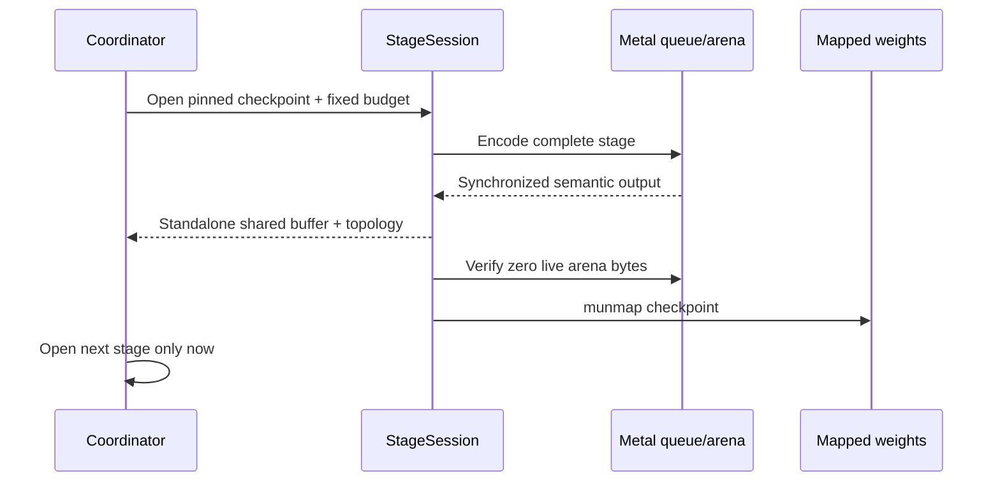

# TRELLIS.2 On Apple Silicon

This document is the evidence ledger for KernelGoblin's TRELLIS.2 port. The
friendly tour lives in the root `README.md`; this is where we keep exact
boundaries, pins, observed memory, and the awkward differences that still
matter.

## Current Claim

The 512 production graph is implemented in Swift and Metal, including raw image
preprocessing, DINOv3 conditioning, sparse and structured-latent flows, native
shape encoding/decoding, flexible-dual-grid geometry, UV preparation,
six-channel PBR decoding, Metal texture baking, Telea inpainting, and GLB
writing/reload validation.

The default 12-step **existing-mesh texturing** and **512 image-to-PBR**
workflows are end-to-end verified on a physical Apple M3 Pro. Both artifacts
reload natively and through Assimp. The machine-readable full-model status is
`verified-native-512`; 1024 and cascade modes remain oracle-only.

The shipping boundary is:

```text
production = Swift + Metal + Apple system frameworks
oracle     = isolated Python + Torch + MPS under build/
```

`./kg validate` enforces allowed native source extensions, forbidden runtime
imports, and the empty external Swift-package dependency set.
`./kg model native-audit trellis2` audits the release Mach-O and currently finds
zero Python/Torch/MLX dependencies.

## Pinned Provenance

| Artifact | Revision | License / access |
| --- | --- | --- |
| [`microsoft/TRELLIS.2`](https://github.com/microsoft/TRELLIS.2) | `75fbf0183001ed9876c8dbb35de6b68552ee08bd` | MIT |
| `microsoft/TRELLIS.2-4B` | `af44b45f2e35a493886929c6d786e563ec68364d` | MIT, open weights |
| `microsoft/TRELLIS-image-large` | `25e0d31ffbebe4b5a97464dd851910efc3002d96` | MIT, open weights |
| `facebook/dinov3-vitl16-pretrain-lvd1689m` | `ea8dc2863c51be0a264bab82070e3e8836b02d51` | Separate gated terms |
| [`drumih/turbo-fieldfare`](https://github.com/drumih/turbo-fieldfare) | `1859181ae26eb39c9698437f806be62adc01367c` | Architecture research pin |

TRELLIS.2's weights are open. DINOv3 is a separate dependency used for image
conditioning, which is why a fresh install still needs accepted DINO terms and
`HF_TOKEN`. The native installer records the repository, revision, path, byte
count, and SHA-256 for every selected file.

## Exact Native Workflows

### Image To PBR GLB

1. Decode the image with Apple frameworks.
2. Validate or create a foreground mask, crop the alpha bounds, premultiply,
   resize to 518, center-crop to 512, and apply ImageNet normalization.
3. Run the complete DINOv3 ViT-L/16 conditioner over 1,029 tokens.
4. Sample the dense 16-cubed sparse-structure flow with the pinned 12-step
   Euler/CFG schedule.
5. Decode occupancy at 64 cubed and pool ordered coordinates to 32 cubed.
6. Sample the 30-block shape flow.
7. Sample the 30-block texture flow while the shape latent is available.
8. Decode the native sparse shape hierarchy, transform its seven-channel head,
   build the flexible-dual-grid mesh, and fill triangle/quad boundary holes.
9. Decode six PBR channels over the shape-guided sparse hierarchy.
10. Prepare a topology-safe UV atlas, rasterize positions in UV space on Metal,
   sample sparse PBR fields, and inpaint uncovered texels.
11. Pack base-color/alpha and metallic-roughness textures into a GLB, reload it,
    validate geometry/material/embedded PNG contracts, and hash the artifact.

### Existing Mesh Texturing

1. Load and combine Model I/O meshes with transforms applied.
2. Normalize geometry with the pinned TRELLIS rule.
3. Preserve supplied UVs, generate with Model I/O only when topology remains
   exact, or use the deterministic native per-face fallback.
4. Convert the mesh to O-Voxel flexible-dual-grid coordinates in Swift.
5. Build the exact centered six-channel shape-encoder input.
6. Run DINOv3, the complete shape encoder, texture flow, and guided texture
   decoder one stage at a time.
7. Bake and reload the same native PBR GLB contract.

## Stage Ownership And Smaller Macs

Each heavyweight stage is owned by a `StageSession`:



The arena has a hard capacity and records capacity, peak live bytes, cumulative
requested bytes, allocation count, and live bytes after close. Oversized work
fails instead of silently growing the allocator. Checkpoints are authenticated
before execution and mapped with `MTLBuffer(bytesNoCopy:)` rather than copied
into a second weight-sized heap.

This borrows Turbo Fieldfare's strongest ideas: explicit ownership, mapped
files, verified receipts, and measured lifecycle boundaries. TRELLIS does not
use its SSD expert cache because every dense stage reuses every block on every
step.

## Verification Ledger

The table deliberately separates full production stages from analytic or tiny
fixtures.

| Surface | Evidence level | Strongest accepted evidence |
| --- | --- | --- |
| Safetensors and mapping | Native foundation | Exact integer parsing, range validation, one mapped descriptor, full-file SHA-256, unmap witness |
| DINOv3 conditioner | Full native stage | 24 blocks, real 1.21 GB checkpoint, 1,029 tokens, max error `5.30e-5`, RMS `1.92e-6`, physical Metal |
| Shape SLat flow | Full native stage | Real 2.58 GB checkpoint, all 30 blocks, tiny-graph RMS `0.00615` |
| Texture SLat flow | Full native stage | Separate real 2.58 GB checkpoint, all 30 blocks, tiny-graph RMS `0.00733` |
| Euler + CFG | Native orchestration | Exact 12-step schedule, interval CFG/rescale, sequential positive/negative calls, normalization boundaries |
| Sparse-structure flow | Production native execution | 4,096 tokens, all 22 model calls; teacher probes <= `0.01376` normalized RMS; 555,905,112-byte arena peak |
| Sparse occupancy decoder | Full native stage | All 74 tensors, 16-to-64 spatial graph, exact occupancy fixture, normalized RMS `0.000181`, 234,881,024-byte peak |
| Occupancy extraction | Native Swift | Strict `> 0`, NaN/zero behavior, z-fast ordering, exact 2x pooling |
| Shape decoder | Full native graph on authenticated small topology | 32 ConvNeXt blocks, four subdivisions, exact coordinates, normalized RMS `0.000628` |
| Texture decoder | Full guided graph on authenticated small topology | 32 blocks, four guides, exact coordinates, raw RMS `0.001523`, PBR RMS `0.001251` |
| Mesh -> O-Voxel -> shape encoder | Authenticated production handoff fixture | Exact coordinates/flags/guides; dual vertices <= `2e-5`; latent normalized RMS `0.000555` |
| O-Voxel voxelizer | Native CPU differential | 119 pinned oracle voxels; exact coordinate order and flags; dual vertices <= `2e-5` |
| Flexible-dual-grid mesh | Native analytic differential | Axis connectivity, missing quads, diagonal/tie rule, head transform on physical Metal |
| Hole filling | Native upstream behavior fixture | Pinned Trimesh-compatible triangle and quad boundary loops |
| UV preparation | Native component | Supplied preservation, deterministic Model I/O atlas, strict face-count gate, topology-safe per-face fallback |
| UV raster | Physical Metal component | Coverage, interpolation, winding, face IDs, degenerate and shared-edge behavior |
| PBR sampling/packing | Native component | Half-voxel sparse sampling, OpenCV-compatible Telea behavior, glTF channel packing, embedded PNG reload |
| Existing-mesh texturing | Native end-to-end | Default 12 steps, real mesh/image/checkpoints, 223,711 faces preserved, two 2048 textures, GLB reload |
| Image-to-PBR generation | Native end-to-end | Default 12 steps, real image/checkpoints, 3,370,530 faces, two 2048 textures, native and Assimp GLB reload |
| 512 image-to-3D oracle | Torch/MPS end-to-end | Default 12 steps, reloadable 61 MB GLB |
| 1024 cascade oracle | Torch/MPS end-to-end | Historical default-step observation: reloadable 272.8 MB GLB, 15.28 GB maximum RSS, zero swaps; not a current benchmark record |

The final native conformance command passed 99 tests in 15 suites under Metal
API validation. It included the production 12-step sparse trajectory, every
real-checkpoint stage, the mesh-to-encoder handoff, and physical Metal kernel
tests, executed serially to avoid cross-test GPU-memory contention.

## Native Existing-Mesh Artifact Record

Acceptance input:

```text
mesh  = upstream assets/example_texturing/the_forgotten_knight.ply
image = docs/assets/trellis2-input-t.png
steps = 12
texture = 2048 x 2048
seed = 42 using native SplitMix64 + Box-Muller
uv policy = regenerate with topology-safe fallback
```

Observed on Apple M3 Pro under Metal API validation:

The exact command, OS/toolchain and GPU-core disclosure, timing boundary, raw
stage ledger, and `/usr/bin/time` output are committed in
[`evidence/trellis2-native-texturing-m3pro-2026-08-01.md`](evidence/trellis2-native-texturing-m3pro-2026-08-01.md).

| Evidence | Value |
| --- | ---: |
| Wall time | 202.92 s |
| Maximum RSS | 3,042,181,120 bytes |
| Peak memory footprint reported by `/usr/bin/time -l` | 7,477,478,456 bytes |
| Swaps | 0 |
| Source vertices / faces | 153,723 / 223,711 |
| GLB accessor vertices / faces | 671,133 / 223,711 |
| Assimp imported faces | 223,711 |
| Embedded textures | 2 |
| Texture size | 2048 x 2048 |
| Covered texels | 2,959,061 |
| GLB bytes | 36,571,340 |
| GLB SHA-256 | `37ad68cca494628cf29dafdfa1989200dd448048af9346dbe4b126ec710083c3` |

The GLB has more accessor vertices because the deterministic fallback gives
each triangle its own UV island. Assimp may merge identical imported vertices;
the invariant that matters here is that every valid source face survives.

Stage evidence recorded zero live arena bytes after every close. The largest
stage peaks were 937,105,448 bytes for the shape encoder and 849,578,732 bytes
for the texture decoder. The process-level footprint is larger than RSS because
macOS reports several unified-memory views; neither number should be confused
with the sum of every declared arena capacity.

## Native Image-To-PBR Artifact Record

The accepted native 512 generation used the supplied-alpha reference image,
12 steps, a 2048 texture, seed 42, and the complete eight-component pinned
checkpoint installation. The exact command, toolchain, raw stage ledger, and
process accounting are committed in
[`evidence/trellis2-native-generation-m3pro-2026-08-01.md`](evidence/trellis2-native-generation-m3pro-2026-08-01.md).

| Evidence | Value |
| --- | ---: |
| Wall time | 2,357.20 s |
| Maximum RSS | 2,994,143,232 bytes |
| Peak memory footprint reported by `/usr/bin/time -l` | 7,245,727,112 bytes |
| Swaps | 0 |
| Decoded mesh vertices / faces | 1,575,509 / 3,370,530 |
| GLB accessor vertices / faces | 10,111,590 / 3,370,530 |
| Embedded textures | 2 |
| Texture size | 2048 x 2048 |
| GLB bytes | 378,336,688 |
| GLB SHA-256 | `b3e941111c1209f86311ec575ef09d110076c885e978e7063ad140d3049d79bf` |

Every recorded arena returned to zero live bytes before close. The largest
arena peaks were 1,731,914,492 bytes in shape decoding and 1,728,631,324 bytes
in texture decoding. The 39-minute wall time is dominated by three complete
12-step diffusion flows, not by GLB writing.

## Geometry-Only Mode

`./kg model run trellis2 --geometry-only` follows the production image path
through DINOv3, sparse-structure flow and decoding, shape flow, shape decoding,
small-hole repair, and mesh extraction. It then writes and reloads a GLB with
normals and a neutral factor-only material, without emitting a UV accessor.
Texture flow, texture decoding, UV work, rasterization, inpainting, and PBR
baking are not opened or executed. `--feature geometry` installs only the five
checkpoints this path opens.

A one-step Hisar control-path run under Metal API validation completed in
198.94 seconds, preserved 1,684,057 generated vertices and 3,671,130 faces in
the native GLB contract, reloaded through both the native validator and Assimp,
and recorded zero swaps. This proves stage selection and artifact integrity; it
is not a default-quality geometry claim. Default-quality inspection still uses
12 steps. The immutable command, stage ledger, process accounting, and artifact
hash are in
[`docs/evidence/trellis2-native-geometry-m3pro-2026-08-01.md`](evidence/trellis2-native-geometry-m3pro-2026-08-01.md).

## Numerical Drift And Semantic Differences

| Difference | Impact | Current contract |
| --- | --- | --- |
| Native RNG vs PyTorch RNG | Same numeric seed does not produce the upstream noise stream | `--seed` is stable native reproducibility; oracle fixtures inject captured upstream values |
| BF16 reduction order | Small per-call differences feed back through later denoising calls | Teacher-forced conformance and free-running structural IoU are reported separately |
| Apple Vision vs RMBG | Foreground matte can differ around hair, transparency, or ambiguous backgrounds | Alpha input can be required; Vision is the documented native portability policy |
| Model I/O/per-face atlas vs CuMesh | Seams and texel efficiency differ | Never lose topology; record implementation and UV fingerprint; CuMesh parity remains a quality gate |
| Supplied UV preservation | Useful extension differs from pinned upstream default regeneration | `regenerate` is the closer parity policy; preservation is explicitly user-selected |
| Metal UV raster vs nvdiffrast | Edge coverage and interpolation can differ | Analytic Metal contracts pass; representative CUDA golden coverage remains open |
| Native triangle/quad hole fill vs Trimesh | Larger or complex boundary loops may differ | Pinned upstream call-site behavior is covered for its supported small loops |

For the sparse structure trajectory, captured identical upstream inputs at
early, middle, and late calls stay below `0.01376` normalized RMS. Feeding the
native BF16 outputs back through all 22 calls ends at `0.7208` occupancy IoU.
This is accepted as structural stability for continued port work, not described
as exact same-seed parity.

## Benchmark Boundaries

The dense benchmark compares the original tiled BF16 projection with the
optional SIMD-group matrix path. It correctness-gates both implementations,
warms up, synchronizes every measurement, and counterbalances order. Existing
M3 Pro measurements showed wins on representative multi-row projections and a
loss on one-row conditioning, so dispatch keeps rows below eight on the tiled
path.

The PBR benchmark is named `kg-trellis2-pbr-bake-bench` on purpose. It measures
Metal UV rasterization plus sparse trilinear sampling over an analytic dense
field. It excludes shader compilation, decoded-field upload, CPU packing,
Telea passes, PNG/GLB encoding, filesystem output, and validation. It is useful
for regression work, not a full-PBR or representative-model speed claim.

No performance number becomes a repository claim until its command, device,
OS, workload, warmup, iterations, synchronization, timing boundary, raw samples,
and correctness hash are disclosed.

## Reproduce The Native Ladder

```sh
./kg doctor
./kg validate

# Build only. No weights or oracle environment.
./kg model native-setup trellis2

# Install pinned native weights, reusing verified HF cache entries.
./kg model setup trellis2 --feature all

# Full real-checkpoint component/stage conformance.
./kg model test trellis2

# Binary dependency audit and benchmarks.
./kg model native-audit trellis2
./kg model native-benchmark trellis2
./kg model native-attention-benchmark trellis2
./kg model native-normalization-benchmark trellis2
./kg model native-pbr-benchmark trellis2
```

The direct release CLI also supports `install`, `generate`, `texture`,
`verify-glb`, checkpoint inspection, and focused real-layer verification.

## Optional Oracle Ladder

```sh
./kg model oracle-setup trellis2
./kg model oracle-test trellis2

./kg model oracle-run trellis2 \
  --pipeline-type 1024_cascade \
  --input image.png \
  --output build/trellis2/oracle-1024
```

Oracle fixture exporters pin source paths and hashes, require
`PYTORCH_ENABLE_MPS_FALLBACK=0` where applicable, and write immutable payloads
under `Tests/KernelGoblinTrellis2Tests/Fixtures/`. Native tests authenticate the
fixture before comparing it.

## Remaining Acceptance Gates

1. Render more native artifacts and compare silhouette,
   topology, texture, and material behavior with the pinned oracle.
2. Add representative model-derived PBR bake benchmarks before publishing bake
   performance as anything beyond an analytic microbenchmark.
3. Improve UV chart quality toward the pinned CuMesh behavior without relaxing
   the exact face-preservation gate.
4. Profile the accepted end-to-end graph, then optimize the production sparse
   kernels that dominate wall time.

The durable architecture and installer rationale live in
[`NATIVE_TRELLIS2_ARCHITECTURE.md`](NATIVE_TRELLIS2_ARCHITECTURE.md).
